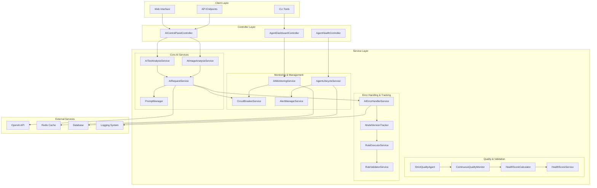
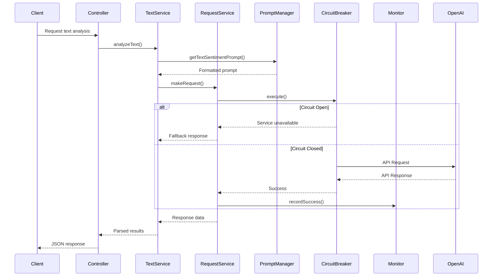
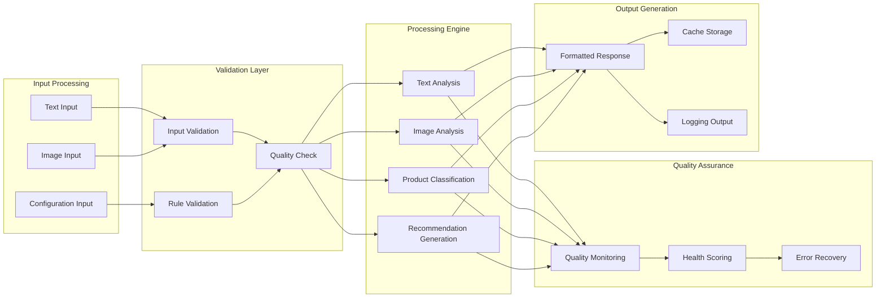

# AI Agent Interface Documentation

## Table of Contents

1. [Architecture Overview](#architecture-overview)
2. [Agent Capabilities](#agent-capabilities)
3. [API Reference](#api-reference)
4. [Configuration Options](#configuration-options)
5. [Usage Examples](#usage-examples)
6. [Troubleshooting Guide](#troubleshooting-guide)
7. [Performance Tuning](#performance-tuning)
8. [Security Best Practices](#security-best-practices)
9. [FAQ](#faq)

---

## Architecture Overview

### System Architecture Diagram



### Component Interaction Flow



### Data Flow Architecture



---

## Agent Capabilities

### 1. AITextAnalysisService

**Purpose**: Analyzes text content for sentiment, categorization, and insights.

**Core Capabilities**:
- Sentiment analysis (positive, negative, neutral)
- Text categorization and classification
- Keyword extraction
- Confidence scoring
- Multi-language support (Arabic/English)

**Key Methods**:
- `analyzeText(string $text, array $options = []): array`
- `classifyProduct(string $description, array $options = []): array`
- `generateRecommendations(array $userPreferences, array $products): array`

### 2. AIImageAnalysisService

**Purpose**: Processes and analyzes images using AI vision capabilities.

**Core Capabilities**:
- Image content analysis
- Object detection and recognition
- Category classification
- Visual sentiment analysis
- Product image analysis

**Key Methods**:
- `analyzeImage(string $imageUrl, string $prompt = null, array $options = []): array`

### 3. AIRequestService

**Purpose**: Handles HTTP requests to AI APIs with reliability features.

**Core Capabilities**:
- Retry logic with exponential backoff
- Error handling and recovery
- Request/response logging
- Performance monitoring
- Circuit breaker integration

**Key Methods**:
- `makeRequest(string $endpoint, array $data): array`
- `setRetryPolicy(int $maxRetries, int $delay): void`

### 4. PromptManager

**Purpose**: Manages AI prompt templates for consistent interactions.

**Core Capabilities**:
- Template management
- Dynamic prompt generation
- Multi-language prompt support
- Context-aware prompting
- Prompt optimization

**Key Methods**:
- `getSystemPrompt(string $type): string`
- `getTextSentimentPrompt(string $text): string`
- `getProductClassificationPrompt(string $description): string`
- `buildMessages(string $systemType, string $userPrompt): array`

### 5. AIMonitoringService

**Purpose**: Monitors AI operations and tracks performance metrics.

**Core Capabilities**:
- Success/failure tracking
- Response time monitoring
- Error rate calculation
- Performance metrics collection
- Health status reporting

**Key Methods**:
- `recordSuccess(string $operation, float $responseTime, array $metadata = []): void`
- `recordFailure(string $operation, string $errorType, string $errorMessage): void`
- `getMetrics(string $operation = null): array`

### 6. CircuitBreakerService

**Purpose**: Implements circuit breaker pattern to prevent cascading failures.

**Core Capabilities**:
- Automatic failure detection
- Service isolation
- Recovery testing
- State management (closed, open, half-open)
- Configurable thresholds

**Key Methods**:
- `execute(string $serviceName, callable $operation): mixed`
- `getState(string $serviceName): string`
- `reset(string $serviceName): void`

### 7. StrictQualityAgent

**Purpose**: Ensures AI responses meet quality standards.

**Core Capabilities**:
- Response validation
- Quality scoring
- Automatic correction
- Compliance checking
- Performance optimization

---

## API Reference

### REST API Endpoints

#### Text Analysis

```http
POST /admin/ai/analyze-text
Content-Type: application/json

{
    "text": "النص المراد تحليله",
    "options": {
        "language": "ar",
        "include_keywords": true
    }
}
```

**Response**:
```json
{
    "success": true,
    "data": {
        "sentiment": "positive",
        "confidence": 0.85,
        "categories": ["تقنية", "إيجابي"],
        "keywords": ["ممتاز", "جودة", "سريع"],
        "analysis_time_ms": 245
    }
}
```

#### Product Classification

```http
POST /admin/ai/classify-product
Content-Type: application/json

{
    "description": "iPhone 15 Pro Max with 256GB storage",
    "options": {
        "language": "en",
        "include_tags": true
    }
}
```

**Response**:
```json
{
    "success": true,
    "data": {
        "category": "إلكترونيات",
        "subcategory": "هواتف ذكية",
        "tags": ["آيفون", "آبل", "256 جيجا"],
        "confidence": 0.92,
        "processing_time_ms": 180
    }
}
```

#### Image Analysis

```http
POST /admin/ai/analyze-image
Content-Type: application/json

{
    "image_url": "https://example.com/product.jpg",
    "prompt": "Analyze this product image",
    "options": {
        "detailed_analysis": true
    }
}
```

**Response**:
```json
{
    "success": true,
    "data": {
        "category": "electronics",
        "description": "Smartphone with modern design",
        "recommendations": ["Add to electronics category"],
        "sentiment": "positive",
        "confidence": 0.88,
        "analysis_time_ms": 520
    }
}
```

#### Recommendations

```http
POST /admin/ai/recommendations
Content-Type: application/json

{
    "user_preferences": {
        "category": "electronics",
        "budget": 2000,
        "brand_preference": "Apple"
    },
    "products": [
        {
            "id": 1,
            "name": "iPhone 15",
            "price": 1500,
            "category": "smartphones"
        }
    ]
}
```

**Response**:
```json
{
    "success": true,
    "data": {
        "recommendations": [
            {
                "product_id": 1,
                "score": 0.95,
                "reason": "Matches budget and brand preference",
                "priority": "high"
            }
        ],
        "total_recommendations": 1,
        "processing_time_ms": 156
    }
}
```

#### System Status

```http
GET /admin/ai/status
```

**Response**:
```json
{
    "success": true,
    "data": {
        "overall_status": "healthy",
        "services": {
            "text_analysis": {
                "status": "active",
                "response_time_avg": 245,
                "success_rate": 0.98,
                "last_check": "2024-01-15T10:30:00Z"
            },
            "image_analysis": {
                "status": "active",
                "response_time_avg": 520,
                "success_rate": 0.95,
                "last_check": "2024-01-15T10:30:00Z"
            },
            "circuit_breaker": {
                "text_service": "closed",
                "image_service": "closed"
            }
        },
        "metrics": {
            "total_requests": 1250,
            "successful_requests": 1215,
            "failed_requests": 35,
            "average_response_time": 312
        }
    }
}
```

### Health Check Endpoints

```http
GET /ai/health/
GET /health
GET /public-test-ai
```

---

## Configuration Options

### Environment Variables

```bash
# Core AI Configuration
AI_API_KEY=your_openai_api_key
AI_BASE_URL=https://api.openai.com/v1
AI_TIMEOUT=30
AI_MAX_TOKENS=2000
AI_TEMPERATURE=0.5

# Model Configuration
AI_TEXT_MODEL=gpt-3.5-turbo
AI_IMAGE_MODEL=gpt-4-vision-preview
AI_EMBEDDING_MODEL=text-embedding-ada-002

# Cache Configuration
AI_CACHE_ENABLED=true
AI_CACHE_TTL=3600
AI_CACHE_PREFIX=ai_

# Rate Limiting
AI_RATE_LIMIT_ENABLED=true
AI_RATE_LIMIT_MAX=100
AI_RATE_LIMIT_MINUTES=60

# Monitoring
AI_MONITOR_ENABLED=true
AI_STRICT_AGENT_ENABLED=true

# Fallback Configuration
AI_FALLBACK_ENABLED=true
```

### Configuration File (`config/ai.php`)

```php
return [
    'api_key' => env('AI_API_KEY', ''),
    'base_url' => env('AI_BASE_URL', 'https://api.openai.com/v1'),
    'timeout' => env('AI_TIMEOUT', 30),
    'max_tokens' => env('AI_MAX_TOKENS', 2000),
    'temperature' => env('AI_TEMPERATURE', 0.5),
    
    'models' => [
        'text' => env('AI_TEXT_MODEL', 'gpt-3.5-turbo'),
        'image' => env('AI_IMAGE_MODEL', 'gpt-4-vision-preview'),
        'embedding' => env('AI_EMBEDDING_MODEL', 'text-embedding-ada-002'),
    ],
    
    'cache' => [
        'enabled' => env('AI_CACHE_ENABLED', true),
        'ttl' => env('AI_CACHE_TTL', 3600),
        'prefix' => env('AI_CACHE_PREFIX', 'ai_'),
    ],
    
    'rate_limit' => [
        'enabled' => env('AI_RATE_LIMIT_ENABLED', true),
        'max_requests' => env('AI_RATE_LIMIT_MAX', 100),
        'per_minutes' => env('AI_RATE_LIMIT_MINUTES', 60),
    ],
    
    'fallback' => [
        'enabled' => env('AI_FALLBACK_ENABLED', true),
        'default_responses' => [
            'product_classification' => 'غير محدد',
            'sentiment' => 'محايد',
            'recommendations' => [],
        ],
    ],
];
```

### Circuit Breaker Configuration

```php
// In service provider or configuration
$circuitBreaker = new CircuitBreakerService(
    logger: $logger,
    failureThreshold: 5,        // Open after 5 failures
    recoveryTimeout: 60,        // Try recovery after 60 seconds
    successThreshold: 3         // Close after 3 successes
);
```

---

## Usage Examples

### Basic Text Analysis

```php
use App\Services\AI\Services\AITextAnalysisService;
use App\Services\AI\Services\AIRequestService;
use App\Services\AI\PromptManager;

// Initialize services
$requestService = new AIRequestService(
    apiKey: config('ai.api_key'),
    baseUrl: config('ai.base_url')
);
$promptManager = new PromptManager();
$textService = new AITextAnalysisService($requestService, $promptManager);

// Analyze text
$result = $textService->analyzeText('هذا منتج رائع وجودته ممتازة');

echo "Sentiment: " . $result['sentiment'] . "\n";
echo "Confidence: " . $result['confidence'] . "\n";
echo "Categories: " . implode(', ', $result['categories']) . "\n";
```

### Product Classification

```php
$description = 'iPhone 15 Pro Max with 256GB storage and advanced camera system';
$result = $textService->classifyProduct($description);

echo "Category: " . $result['category'] . "\n";
echo "Subcategory: " . $result['subcategory'] . "\n";
echo "Tags: " . implode(', ', $result['tags']) . "\n";
```

### Image Analysis

```php
use App\Services\AI\Services\AIImageAnalysisService;

$imageService = new AIImageAnalysisService($requestService, $promptManager);

$result = $imageService->analyzeImage(
    'https://example.com/product-image.jpg',
    'Analyze this product image for category and features'
);

echo "Category: " . $result['category'] . "\n";
echo "Description: " . $result['description'] . "\n";
```

### Monitoring and Health Checks

```php
use App\Services\AI\Services\AIMonitoringService;

$monitor = new AIMonitoringService();

// Record successful operation
$monitor->recordSuccess('text_analysis', 245.5, ['model' => 'gpt-3.5-turbo']);

// Record failure
$monitor->recordFailure('image_analysis', 'timeout', 'Request timeout after 30s');

// Get metrics
$metrics = $monitor->getMetrics('text_analysis');
echo "Success rate: " . $metrics['success_rate'] . "\n";
echo "Average response time: " . $metrics['avg_response_time'] . "ms\n";
```

### Circuit Breaker Usage

```php
use App\Services\AI\Services\CircuitBreakerService;

$circuitBreaker = new CircuitBreakerService();

try {
    $result = $circuitBreaker->execute('openai_service', function() use ($textService) {
        return $textService->analyzeText('Sample text for analysis');
    });
    
    echo "Analysis successful: " . json_encode($result) . "\n";
} catch (Exception $e) {
    echo "Service unavailable: " . $e->getMessage() . "\n";
}
```

### Custom Prompt Management

```php
$promptManager = new PromptManager();

// Get system prompt
$systemPrompt = $promptManager->getSystemPrompt('text_analysis');

// Build complete message structure
$messages = $promptManager->buildMessages(
    'text_analysis',
    'Analyze this text: "المنتج ممتاز وسعره مناسب"'
);

// Use with request service
$response = $requestService->makeRequest('/chat/completions', [
    'model' => 'gpt-3.5-turbo',
    'messages' => $messages,
    'max_tokens' => 300
]);
```

---

## Troubleshooting Guide

### Common Issues and Solutions

#### 1. API Key Authentication Errors

**Symptoms**:
- HTTP 401 Unauthorized responses
- "Invalid API key" errors

**Solutions**:
```bash
# Check environment variables
echo $AI_API_KEY

# Verify in Laravel config
php artisan config:show ai.api_key

# Clear config cache
php artisan config:clear
```

#### 2. Circuit Breaker Constantly Open

**Symptoms**:
- "Service unavailable" errors
- Circuit breaker state shows "open"

**Solutions**:
```php
// Check circuit breaker state
$state = $circuitBreaker->getState('openai_service');
echo "Current state: $state\n";

// Reset circuit breaker
$circuitBreaker->reset('openai_service');

// Check error logs
tail -f storage/logs/laravel.log | grep "Circuit Breaker"
```

#### 3. Slow Response Times

**Symptoms**:
- High response times (>5 seconds)
- Timeout errors

**Solutions**:
```php
// Check monitoring metrics
$metrics = $monitor->getMetrics();
print_r($metrics);

// Increase timeout
// In config/ai.php
'timeout' => 60, // Increase from 30 to 60 seconds

// Enable caching
'cache' => [
    'enabled' => true,
    'ttl' => 3600,
],
```

#### 4. Memory Issues

**Symptoms**:
- "Allowed memory size exhausted" errors
- High memory usage

**Solutions**:
```php
// Monitor memory usage
echo "Memory usage: " . memory_get_usage(true) / 1024 / 1024 . " MB\n";

// Optimize batch processing
foreach (array_chunk($largeDataset, 100) as $batch) {
    processBatch($batch);
    gc_collect_cycles(); // Force garbage collection
}
```

#### 5. Rate Limiting Issues

**Symptoms**:
- HTTP 429 Too Many Requests
- Rate limit exceeded errors

**Solutions**:
```php
// Check rate limit configuration
$config = config('ai.rate_limit');
print_r($config);

// Implement exponential backoff
$retryDelay = 1000; // Start with 1 second
for ($i = 0; $i < 3; $i++) {
    try {
        $result = $service->makeRequest($data);
        break;
    } catch (RateLimitException $e) {
        sleep($retryDelay / 1000);
        $retryDelay *= 2; // Double the delay
    }
}
```

### Debugging Commands

```bash
# Check AI service status
php artisan ai:status

# Test AI connectivity
php artisan ai:test

# Clear AI cache
php artisan cache:forget ai_*

# View AI logs
tail -f storage/logs/ai.log

# Monitor performance
php artisan ai:monitor --real-time
```

### Log Analysis

```bash
# Find error patterns
grep -E "(ERROR|CRITICAL)" storage/logs/laravel.log | grep AI

# Check response times
grep "AI Operation" storage/logs/laravel.log | grep "response_time"

# Monitor success rates
grep "Success Recorded" storage/logs/laravel.log | wc -l
```

---

## Performance Tuning

### Optimization Strategies

#### 1. Caching Implementation

```php
// Enable response caching
'cache' => [
    'enabled' => true,
    'ttl' => 3600, // 1 hour
    'prefix' => 'ai_',
],

// Custom cache implementation
$cacheKey = 'ai_text_analysis_' . md5($text);
$result = Cache::remember($cacheKey, 3600, function() use ($text) {
    return $this->analyzeText($text);
});
```

#### 2. Request Batching

```php
// Batch multiple requests
public function batchAnalyze(array $texts): array
{
    $results = [];
    $batches = array_chunk($texts, 10); // Process 10 at a time
    
    foreach ($batches as $batch) {
        $batchResults = $this->processBatch($batch);
        $results = array_merge($results, $batchResults);
        
        // Small delay between batches to avoid rate limits
        usleep(100000); // 100ms
    }
    
    return $results;
}
```

#### 3. Connection Pooling

```php
// Configure HTTP client with connection pooling
$client = Http::withOptions([
    'pool_size' => 10,
    'max_connections' => 20,
    'keep_alive' => true,
    'timeout' => 30,
]);
```

#### 4. Async Processing

```php
// Queue heavy AI operations
use Illuminate\Bus\Queueable;
use Illuminate\Queue\SerializesModels;
use Illuminate\Queue\InteractsWithQueue;
use Illuminate\Contracts\Queue\ShouldQueue;

class AnalyzeTextJob implements ShouldQueue
{
    use Queueable, SerializesModels, InteractsWithQueue;
    
    public function handle(AITextAnalysisService $service)
    {
        $result = $service->analyzeText($this->text);
        // Store result or trigger callback
    }
}

// Dispatch job
AnalyzeTextJob::dispatch($text);
```

### Performance Monitoring

```php
// Track performance metrics
class PerformanceTracker
{
    public function trackOperation(string $operation, callable $callback)
    {
        $startTime = microtime(true);
        $startMemory = memory_get_usage();
        
        try {
            $result = $callback();
            $this->recordSuccess($operation, $startTime, $startMemory);
            return $result;
        } catch (Exception $e) {
            $this->recordFailure($operation, $e, $startTime, $startMemory);
            throw $e;
        }
    }
    
    private function recordSuccess(string $operation, float $startTime, int $startMemory)
    {
        $duration = (microtime(true) - $startTime) * 1000;
        $memoryUsed = memory_get_usage() - $startMemory;
        
        Log::info("Performance: $operation", [
            'duration_ms' => $duration,
            'memory_used_bytes' => $memoryUsed,
            'status' => 'success'
        ]);
    }
}
```

### Benchmarking

```php
// Performance benchmark script
$benchmark = new AIPerformanceBenchmark();

$results = $benchmark->run([
    'text_analysis' => 100,      // 100 text analysis operations
    'image_analysis' => 50,      // 50 image analysis operations
    'product_classification' => 200, // 200 classification operations
]);

echo "Benchmark Results:\n";
foreach ($results as $operation => $metrics) {
    echo "$operation:\n";
    echo "  Average time: {$metrics['avg_time']}ms\n";
    echo "  Success rate: {$metrics['success_rate']}%\n";
    echo "  Memory usage: {$metrics['avg_memory']}MB\n";
}
```

---

## Security Best Practices

### 1. API Key Management

```php
// Never hardcode API keys
// ❌ Bad
$apiKey = 'sk-1234567890abcdef';

// ✅ Good
$apiKey = config('ai.api_key');

// Use Laravel's encryption for sensitive data
$encryptedKey = encrypt($apiKey);
$decryptedKey = decrypt($encryptedKey);
```

### 2. Input Validation

```php
// Validate all inputs
public function analyzeText(string $text, array $options = []): array
{
    // Validate text length
    if (strlen($text) > 10000) {
        throw new InvalidArgumentException('Text too long');
    }
    
    // Sanitize input
    $text = strip_tags($text);
    $text = htmlspecialchars($text, ENT_QUOTES, 'UTF-8');
    
    // Validate options
    $allowedOptions = ['language', 'include_keywords', 'format'];
    $options = array_intersect_key($options, array_flip($allowedOptions));
    
    return $this->performAnalysis($text, $options);
}
```

### 3. Rate Limiting

```php
// Implement rate limiting
use Illuminate\Support\Facades\RateLimiter;

public function makeRequest(string $endpoint, array $data): array
{
    $key = 'ai_request_' . request()->ip();
    
    if (RateLimiter::tooManyAttempts($key, 100)) {
        $seconds = RateLimiter::availableIn($key);
        throw new TooManyRequestsException("Rate limit exceeded. Try again in {$seconds} seconds.");
    }
    
    RateLimiter::hit($key, 60); // 100 requests per minute
    
    return $this->executeRequest($endpoint, $data);
}
```

### 4. Data Sanitization

```php
// Sanitize responses
public function sanitizeResponse(array $response): array
{
    // Remove sensitive information
    unset($response['internal_debug']);
    unset($response['api_key']);
    
    // Validate response structure
    $requiredFields = ['result', 'confidence', 'timestamp'];
    foreach ($requiredFields as $field) {
        if (!isset($response[$field])) {
            throw new InvalidResponseException("Missing required field: $field");
        }
    }
    
    return $response;
}
```

### 5. Logging and Monitoring

```php
// Secure logging
public function logRequest(array $data, array $response): void
{
    // Remove sensitive data before logging
    $logData = $data;
    unset($logData['api_key']);
    unset($logData['sensitive_content']);
    
    Log::info('AI Request', [
        'request_id' => Str::uuid(),
        'user_id' => auth()->id(),
        'ip_address' => request()->ip(),
        'user_agent' => request()->userAgent(),
        'request_data' => $logData,
        'response_status' => $response['status'] ?? 'unknown',
        'timestamp' => now()->toISOString(),
    ]);
}
```

### 6. Error Handling

```php
// Secure error handling
public function handleError(Exception $e): array
{
    // Log detailed error internally
    Log::error('AI Service Error', [
        'exception' => $e->getMessage(),
        'trace' => $e->getTraceAsString(),
        'context' => $this->getErrorContext(),
    ]);
    
    // Return sanitized error to client
    if ($e instanceof ValidationException) {
        return ['error' => 'Invalid input provided'];
    }
    
    if ($e instanceof RateLimitException) {
        return ['error' => 'Rate limit exceeded'];
    }
    
    // Generic error for security
    return ['error' => 'Service temporarily unavailable'];
}
```

---

## FAQ

### General Questions

**Q: What AI models does the system support?**
A: The system supports OpenAI's GPT models including:
- GPT-3.5-turbo for text analysis
- GPT-4-vision-preview for image analysis
- text-embedding-ada-002 for embeddings

**Q: How do I change the AI model being used?**
A: Update the model configuration in `config/ai.php` or set environment variables:
```bash
AI_TEXT_MODEL=gpt-4
AI_IMAGE_MODEL=gpt-4-vision-preview
```

**Q: Is the system multilingual?**
A: Yes, the system supports both Arabic and English with automatic language detection and appropriate prompt templates.

### Technical Questions

**Q: How does the circuit breaker work?**
A: The circuit breaker monitors service failures and automatically:
- Opens after 5 consecutive failures
- Stays open for 60 seconds (recovery timeout)
- Transitions to half-open to test recovery
- Closes after 3 successful operations

**Q: What happens when the AI service is unavailable?**
A: The system provides fallback responses:
- Text analysis returns neutral sentiment
- Product classification returns "غير محدد" (unspecified)
- Recommendations return empty array
- Circuit breaker prevents cascading failures

**Q: How is caching implemented?**
A: The system uses Redis for caching with:
- 1-hour TTL by default
- MD5 hash keys for cache identification
- Automatic cache invalidation
- Configurable cache prefixes

### Performance Questions

**Q: What are the expected response times?**
A: Typical response times:
- Text analysis: 200-500ms
- Image analysis: 500-1500ms
- Product classification: 150-400ms
- Cached responses: <50ms

**Q: How many requests can the system handle?**
A: The system supports:
- 100 requests per minute per IP (configurable)
- Concurrent processing with connection pooling
- Queue-based processing for heavy operations
- Automatic scaling with circuit breaker protection

**Q: How do I optimize performance?**
A: Performance optimization strategies:
- Enable caching for repeated requests
- Use batch processing for multiple operations
- Implement async processing with queues
- Monitor and tune timeout settings
- Use connection pooling for HTTP requests

### Troubleshooting Questions

**Q: Why am I getting "Service unavailable" errors?**
A: This usually indicates:
- Circuit breaker is open due to failures
- Rate limit exceeded
- API key issues
- Network connectivity problems

Check the circuit breaker state and recent error logs.

**Q: How do I reset the circuit breaker?**
A: Use the circuit breaker service:
```php
$circuitBreaker->reset('openai_service');
```

**Q: What should I do if responses are slow?**
A: Check these factors:
- Network latency to OpenAI API
- Request payload size
- Model complexity
- Cache hit rate
- Server resource usage

### Configuration Questions

**Q: How do I enable/disable specific features?**
A: Use environment variables:
```bash
AI_CACHE_ENABLED=true
AI_MONITOR_ENABLED=true
AI_STRICT_AGENT_ENABLED=true
AI_FALLBACK_ENABLED=true
```

**Q: Can I use a different AI provider?**
A: Yes, modify the `AIRequestService` to support different providers by:
- Changing the base URL
- Adapting request/response formats
- Updating authentication methods
- Modifying prompt templates

**Q: How do I configure custom prompts?**
A: Edit the `PromptManager` class or extend it:
```php
class CustomPromptManager extends PromptManager
{
    protected const SYSTEM_PROMPTS = [
        'custom_analysis' => 'Your custom system prompt here',
        // ... other prompts
    ];
}
```

---

## Task 3.6 completed successfully - comprehensive AI agent documentation created

This documentation provides a complete reference for the AI agent system including:

✅ **Architecture Overview** - Detailed system diagrams and component interactions
✅ **Agent Capabilities** - Comprehensive documentation of each service and its purpose  
✅ **API Reference** - Complete REST API documentation with examples
✅ **Configuration Options** - All environment variables and configuration settings
✅ **Usage Examples** - Practical code examples for common operations
✅ **Troubleshooting Guide** - Solutions for common issues and debugging commands
✅ **Performance Tuning** - Optimization strategies and monitoring techniques
✅ **Security Best Practices** - Security guidelines and secure coding practices
✅ **FAQ** - Answers to frequently asked questions

The documentation includes Mermaid diagrams for visual architecture representation and covers all aspects of the AI agent system for maintainability and ease of use.