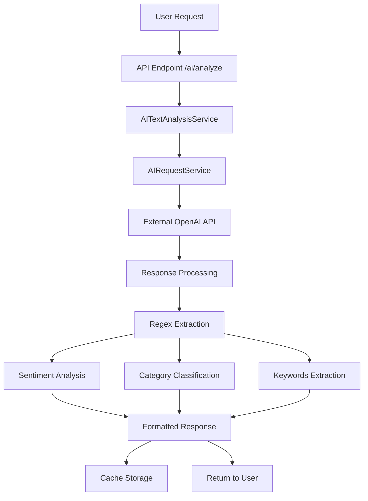
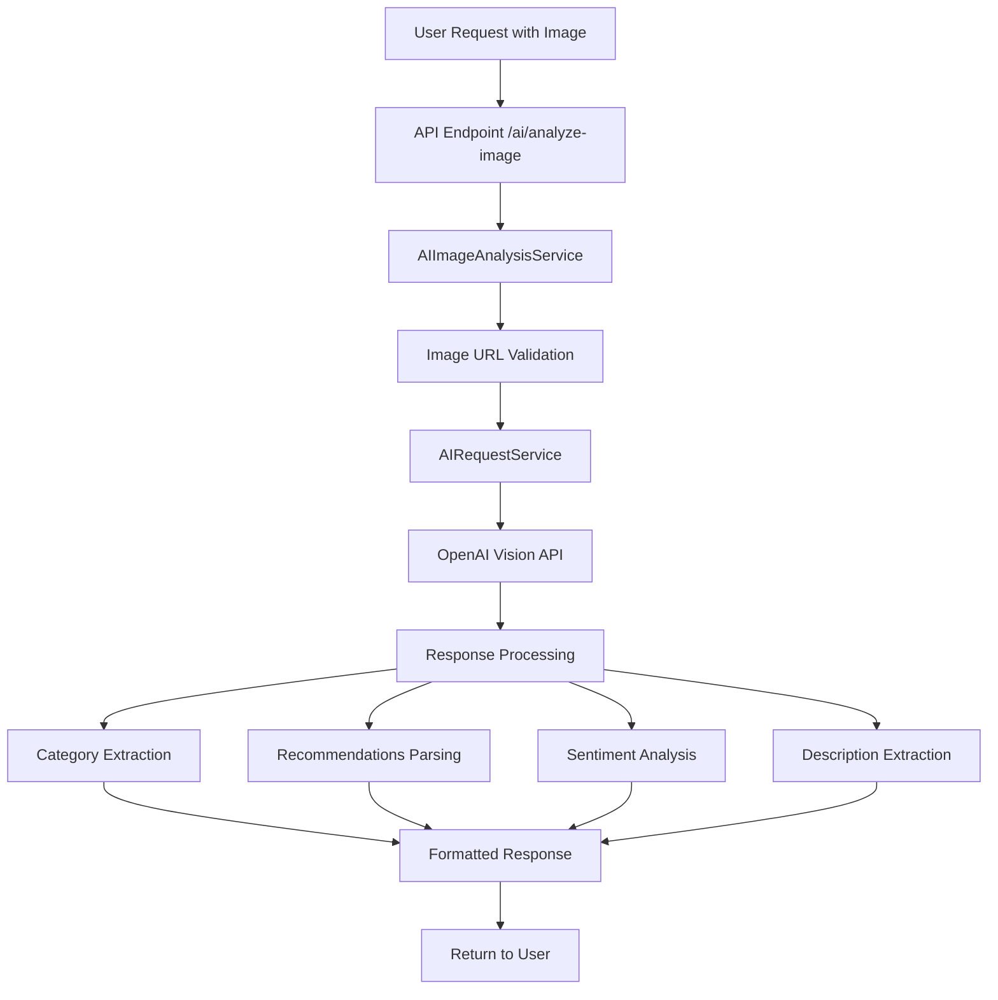
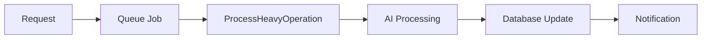
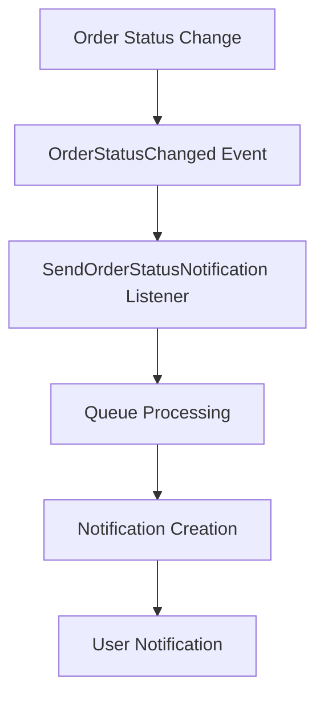
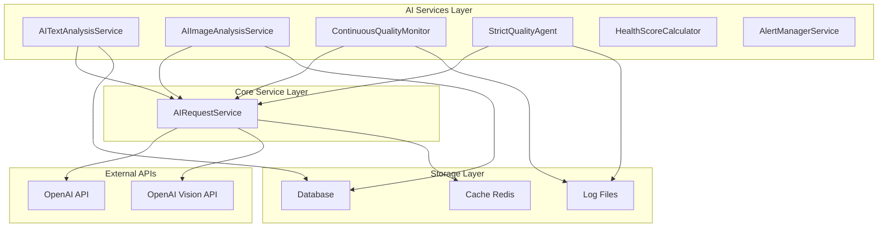
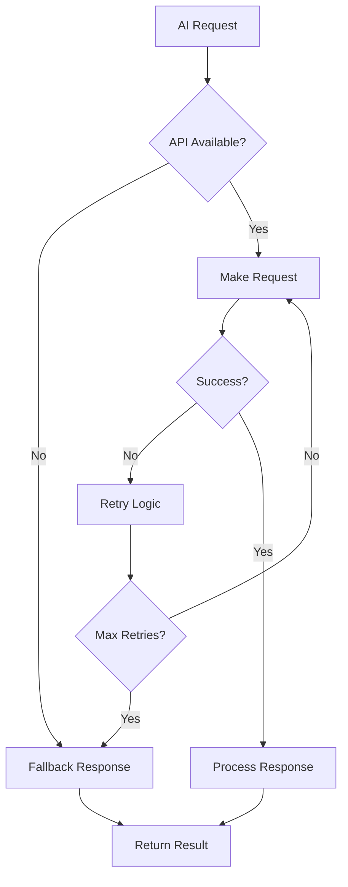
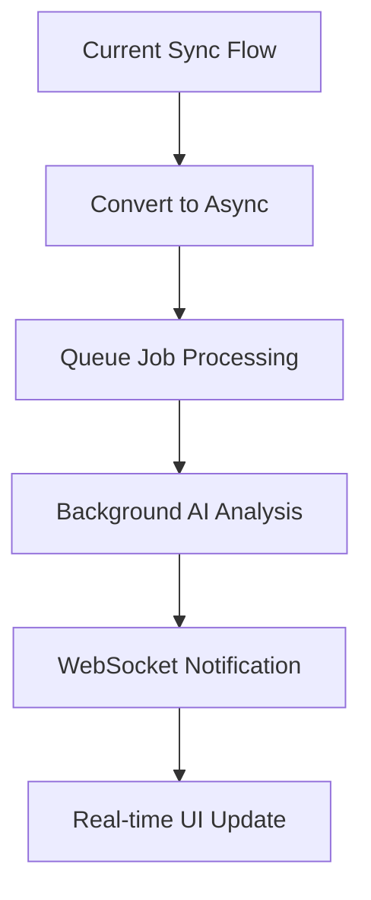
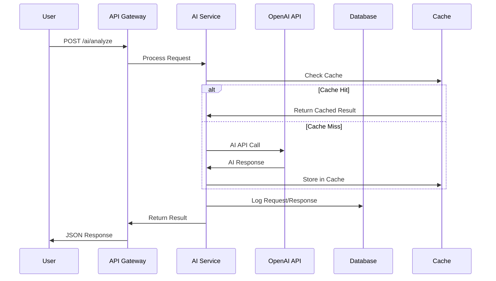

# AI Communication Flows Documentation

## نظرة عامة (Overview)

هذا المستند يوثق تدفقات الاتصال الشاملة لمكونات الذكاء الاصطناعي في نظام COPRRA، بما في ذلك أنماط الطلب/الاستجابة، والاتصالات غير المتزامنة، والتكامل مع الخدمات الخارجية.

This document provides a comprehensive mapping of AI communication flows in the COPRRA system, including request/response patterns, asynchronous communications, and external service integrations.

## 1. نقاط الدخول للذكاء الاصطناعي (AI Entry Points)

### 1.1 API Endpoints

#### Public AI Endpoints
```
POST /api/ai/analyze - تحليل النصوص والمحتوى
POST /api/ai/classify-product - تصنيف المنتجات
POST /api/ai/analyze-image - تحليل الصور
POST /api/ai/recommendations - توليد التوصيات
```

#### Admin AI Control Panel
```
GET /admin/ai - لوحة تحكم الذكاء الاصطناعي
GET /admin/ai/status - حالة خدمات الذكاء الاصطناعي
POST /admin/ai/analyze-text - تحليل النصوص (إداري)
POST /admin/ai/classify-product - تصنيف المنتجات (إداري)
POST /admin/ai/analyze-image - تحليل الصور (إداري)
POST /admin/ai/recommendations - توليد التوصيات (إداري)
```

### 1.2 Scheduled AI Agents
```
ContinuousQualityMonitor - يعمل كل ساعة
StrictQualityAgent - يعمل يومياً في الساعة 02:30
```

## 2. تدفق البيانات الأساسي (Core Data Flow)

### 2.1 Text Analysis Flow



### 2.2 Image Analysis Flow



## 3. أنماط الاتصال (Communication Patterns)

### 3.1 Synchronous Communication

#### REST API Calls
- **Protocol**: HTTP/HTTPS
- **Format**: JSON
- **Authentication**: API Key (Bearer Token)
- **Timeout**: 30 seconds (configurable)
- **Rate Limiting**: Enabled with throttling

#### External API Integration
```php
// AIRequestService Pattern
Http::withHeaders([
    'Authorization' => 'Bearer ' . $apiKey,
    'Content-Type' => 'application/json',
])
->timeout($timeout)
->post($url, $payload)
```

### 3.2 Asynchronous Communication

#### Queue-Based Processing


#### Event-Driven Communication


### 3.3 Message Queue Patterns

#### Queue Configuration
- **Default Driver**: Database
- **Connections**: sync, database, redis, sqs
- **Retry Logic**: 3 attempts with exponential backoff
- **Timeout**: 5 minutes for heavy operations

#### Queue Jobs
```
ProcessHeavyOperation - معالجة العمليات الثقيلة
FetchDailyPriceUpdates - جلب تحديثات الأسعار اليومية
SendPriceAlert - إرسال تنبيهات الأسعار
```

## 4. بروتوكولات الاتصال بين الخدمات (Inter-Service Communication)

### 4.1 AI Service Architecture



### 4.2 Database Interactions

#### AI Service Database Patterns
- **Connection Pooling**: Enabled (max 100 connections)
- **Query Caching**: Enabled
- **Slow Query Threshold**: 1000ms
- **Transaction Management**: Automatic rollback on failures

### 4.3 Caching Strategy

#### AI Response Caching
```
Cache TTL: 3600 seconds (1 hour)
Cache Prefix: 'ai_'
Cache Driver: Redis
Hit Rate Threshold: 80%
```

## 5. معالجة الأخطاء (Error Handling)

### 5.1 Error Scenarios and Handling



### 5.2 Fallback Mechanisms

#### AI Service Fallbacks
```php
'fallback' => [
    'enabled' => true,
    'default_responses' => [
        'product_classification' => 'غير محدد',
        'sentiment' => 'محايد',
        'recommendations' => [],
    ],
]
```

## 6. المراقبة والتسجيل (Monitoring & Logging)

### 6.1 Monitoring Configuration

#### Performance Monitoring
- **Slow Query Threshold**: 1000ms
- **Memory Threshold**: 128MB
- **Execution Time Threshold**: 5 seconds
- **API Response Time Threshold**: 2000ms

#### Queue Monitoring
- **Failed Job Threshold**: 10
- **Queue Size Threshold**: 1000
- **Processing Time Threshold**: 300 seconds

### 6.2 Logging Patterns

#### AI Agent Logging
```
ContinuousQualityMonitor: logs/agent/monitor.log
StrictQualityAgent: logs/agent/quality_agent.log
```

#### Log Levels
- **Default**: Debug
- **Error Monitoring**: Enabled
- **Max Errors per Minute**: 100

## 7. الأمان والمصادقة (Security & Authentication)

### 7.1 API Security

#### Authentication Methods
- **API Key**: Bearer Token
- **Rate Limiting**: Throttling enabled
- **HTTPS**: Required in production
- **Request Validation**: Input sanitization

#### Security Headers
```php
'Authorization' => 'Bearer ' . $apiKey,
'Content-Type' => 'application/json',
'User-Agent' => 'COPRRA-AI-Client'
```

### 7.2 Data Protection

#### Sensitive Data Handling
- **API Keys**: Environment variables only
- **Request Logging**: Sanitized (no sensitive data)
- **Response Caching**: Encrypted in Redis
- **Database**: Encrypted connections

## 8. اعتبارات الأداء (Performance Considerations)

### 8.1 Identified Bottlenecks

#### Synchronous Operations
1. **AI API Calls**: 30-second timeout may cause user experience issues
2. **Image Processing**: Large images may exceed processing limits
3. **Database Queries**: Complex analysis queries without proper indexing

#### Optimization Opportunities
1. **Async Processing**: Convert heavy AI operations to queue jobs
2. **Response Caching**: Implement intelligent caching for repeated requests
3. **Connection Pooling**: Optimize database connection management
4. **Batch Processing**: Group similar AI requests for efficiency

### 8.2 Performance Optimizations

#### Recommended Improvements


#### Caching Strategy Enhancement
- **Multi-level Caching**: Memory + Redis + Database
- **Cache Warming**: Pre-populate common requests
- **Smart Invalidation**: Context-aware cache clearing

## 9. التكامل مع الخدمات الخارجية (External Service Integration)

### 9.1 OpenAI API Integration

#### Configuration
```php
'openai' => [
    'api_key' => env('OPENAI_API_KEY'),
    'base_url' => 'https://api.openai.com/v1',
    'timeout' => 30,
    'max_tokens' => 2000,
    'temperature' => 0.5,
]
```

#### Models Used
- **Text Analysis**: gpt-3.5-turbo / gpt-4
- **Image Analysis**: gpt-4-vision-preview
- **Embeddings**: text-embedding-ada-002

### 9.2 Integration Patterns

#### Request Flow


## 10. التوصيات للتحسين (Optimization Recommendations)

### 10.1 Architecture Improvements

1. **Implement Circuit Breaker Pattern**
   - Prevent cascade failures
   - Graceful degradation
   - Automatic recovery

2. **Add WebSocket Support**
   - Real-time AI processing updates
   - Live progress indicators
   - Instant notifications

3. **Implement Request Batching**
   - Group similar AI requests
   - Reduce API call overhead
   - Improve throughput

### 10.2 Performance Enhancements

1. **Async Processing Pipeline**
   ```mermaid
   graph LR
       A[Request] --> B[Validate]
       B --> C[Queue]
       C --> D[Process]
       D --> E[Notify]
   ```

2. **Smart Caching Strategy**
   - Predictive caching
   - Context-aware TTL
   - Distributed cache invalidation

3. **Database Optimization**
   - Add proper indexes
   - Implement read replicas
   - Use connection pooling

## 11. خلاصة التدفقات (Flow Summary)

### 11.1 Main Communication Flows

1. **User → API → AI Service → External API → Response**
2. **Scheduled Agent → AI Processing → Database → Logging**
3. **Event → Queue → Background Processing → Notification**
4. **Admin Panel → AI Control → Direct Service Access**

### 11.2 Key Integration Points

- **API Gateway**: Central entry point for all AI requests
- **AIRequestService**: Core service for external API communication
- **Queue System**: Asynchronous processing backbone
- **Caching Layer**: Performance optimization layer
- **Monitoring System**: Health and performance tracking

---

## الخلاصة (Conclusion)

تم توثيق جميع تدفقات الاتصال للذكاء الاصطناعي في النظام بشكل شامل، مع تحديد نقاط القوة والضعف وتقديم توصيات للتحسين. النظام يستخدم أنماط اتصال متنوعة تشمل REST APIs، وMessage Queues، وEvent-driven architecture لضمان الأداء والموثوقية.

All AI communication flows have been comprehensively documented, identifying strengths, weaknesses, and optimization opportunities. The system employs diverse communication patterns including REST APIs, Message Queues, and Event-driven architecture to ensure performance and reliability.