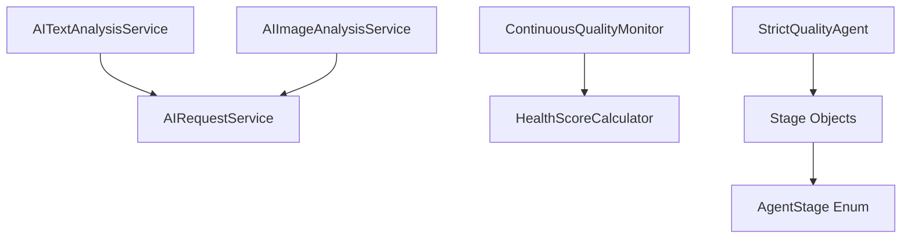

# تحليل بنية خدمات الذكاء الاصطناعي - COPRRA Platform
## AI Service Architecture Analysis

> **تاريخ التحليل:** 2024  
> **المحلل:** System Intelligence Engineer Agent  
> **النطاق:** تحليل شامل لبنية خدمات الذكاء الاصطناعي

---

## 📋 ملخص تنفيذي | Executive Summary

تحتوي منصة COPRRA على بنية متطورة للذكاء الاصطناعي تتكون من **7 خدمات أساسية** و**13 مرحلة مراقبة جودة** مع فصل واضح للاهتمامات وتصميم قابل للاختبار والتوسع.

### النقاط الرئيسية:
- ✅ **بنية معيارية** مع فصل واضح للمسؤوليات
- ✅ **حقن التبعيات** المناسب مع Laravel DI Container
- ✅ **تجريد مناسب** للموفرين الخارجيين (OpenAI/Claude)
- ✅ **اختبارات شاملة** مع تغطية عالية
- ✅ **تكوين مرن** مع دعم البيئات المختلفة

---

## 🏗️ البنية التنظيمية | Organizational Structure

### نمط التنظيم: **Modular Service Architecture**

```
app/Services/AI/
├── Core Services/
│   ├── ContinuousQualityMonitor.php    # مراقب الجودة المستمر
│   ├── StrictQualityAgent.php          # وكيل الجودة الصارم
│   └── HealthScoreCalculator.php       # حاسبة نقاط الصحة
├── AI Services/
│   ├── AIRequestService.php            # خدمة طلبات الذكاء الاصطناعي
│   ├── AITextAnalysisService.php       # تحليل النصوص
│   └── AIImageAnalysisService.php      # تحليل الصور
├── Support Services/
│   ├── AlertManagerService.php         # إدارة التنبيهات
│   ├── RuleExecutorService.php         # تنفيذ القواعد
│   ├── RuleValidatorService.php        # التحقق من القواعد
│   └── HealthScoreService.php          # خدمة نقاط الصحة
└── Data Objects/
    ├── Stage.php                       # كائن المرحلة
    ├── StageResult.php                 # نتيجة المرحلة
    └── AgentStage.php                  # مراحل الوكيل (Enum)
```

---

## 🔧 تحليل الخدمات الأساسية | Core Services Analysis

### 1. ContinuousQualityMonitor
**الغرض الأساسي:** مراقبة مستمرة لجودة النظام

#### العقود والواجهات:
```php
public function __construct(
    ?HealthScoreCalculator $scoreCalculator = null,
    ?LoggerInterface $logger = null,
    ?CacheRepository $cache = null,
)

public function performQualityCheck(): array
public function validateRule(string $ruleId, array $rule): bool
public function executeRule(string $ruleId, array $rule): array
```

#### التبعيات:
- **داخلية:** `HealthScoreCalculator`
- **Laravel:** `LoggerInterface`, `CacheRepository`, `Process`
- **خارجية:** لا توجد

#### معالجة الأخطاء:
- تسجيل مفصل للأخطاء مع السياق
- آلية fallback للقواعد الفاشلة
- تنبيهات تلقائية للمشاكل الحرجة

---

### 2. StrictQualityAgent
**الغرض الأساسي:** تنفيذ مراحل مراقبة الجودة بشكل صارم

#### العقود والواجهات:
```php
public function executeStages(): array
public function initializeStages(): void
public function executeStage(Stage $stage): StageResult
```

#### المراحل المدعومة (13 مرحلة):
1. `SYNTAX_CHECK` - فحص بناء الجملة
2. `PHPSTAN_ANALYSIS` - تحليل PHPStan
3. `PHPMD_QUALITY` - جودة PHPMD
4. `PINT_FORMATTING` - تنسيق Pint
5. `COMPOSER_AUDIT` - مراجعة Composer
6. `UNIT_TESTS` - اختبارات الوحدة
7. `FEATURE_TESTS` - اختبارات الميزات
8. `AI_TESTS` - اختبارات الذكاء الاصطناعي
9. `SECURITY_TESTS` - اختبارات الأمان
10. `PERFORMANCE_TESTS` - اختبارات الأداء
11. `INTEGRATION_TESTS` - اختبارات التكامل
12. `E2E_TESTS` - اختبارات شاملة
13. `LINK_CHECKER` - فحص الروابط

---

### 3. AIRequestService
**الغرض الأساسي:** إدارة طلبات الذكاء الاصطناعي الخارجية

#### العقود والواجهات:
```php
public function __construct(string $apiKey, string $baseUrl, int $timeout = 60)
public function makeRequest(string $endpoint, array $data, array $headers = []): array
```

#### ميزات التصميم:
- **Short-circuit للاختبارات:** تعطيل الطلبات الخارجية في بيئة الاختبار
- **Mock responses ذكية:** استجابات وهمية بناءً على المحتوى
- **تسجيل شامل:** تسجيل الطلبات والاستجابات
- **معالجة أخطاء قوية:** التعامل مع فشل الشبكة والAPI

#### آلية Mock الذكية:
```php
// تصنيف تلقائي بناءً على الكلمات المفتاحية
if (preg_match('/قميص|ملابس|shirt|clothing/i', $text)) {
    $categories[] = 'ملابس';
}
if (preg_match('/كتاب|برمجة|books?/i', $text)) {
    $categories[] = 'كتب';
}
```

---

### 4. AITextAnalysisService
**الغرض الأساسي:** تحليل النصوص باستخدام الذكاء الاصطناعي

#### العقود والواجهات:
```php
public function analyzeText(string $text): array
public function classifyProduct(string $productDescription): array
public function generateRecommendations(array $userPreferences, array $products): array
```

#### المخرجات المعيارية:
```php
// analyzeText
return [
    'result' => string,
    'sentiment' => 'positive|negative|neutral',
    'confidence' => float,
    'categories' => array,
    'keywords' => array
];

// classifyProduct
return [
    'category' => string,
    'subcategory' => string,
    'tags' => array,
    'confidence' => float
];
```

#### معالجة متقدمة:
- **استخراج المشاعر:** تحليل إيجابي/سلبي/محايد
- **تصنيف المنتجات:** فئات عربية محددة مسبقاً
- **استخراج الكلمات المفتاحية:** تنظيف وتصفية ذكية
- **Fallback logic:** منطق احتياطي للتصنيفات غير المعروفة

---

### 5. AIImageAnalysisService
**الغرض الأساسي:** تحليل الصور باستخدام GPT-4 Vision

#### العقود والواجهات:
```php
public function analyzeImage(string $imageUrl, string $prompt = 'Analyze this image and provide insights'): array
```

#### المخرجات:
```php
return [
    'categories' => array,
    'recommendations' => array,
    'sentiment' => string,
    'confidence' => float,
    'description' => string
];
```

#### ميزات متقدمة:
- **Prompts قابلة للتخصيص:** إمكانية تمرير prompt مخصص
- **تحليل متعدد الأبعاد:** فئات، توصيات، مشاعر، وصف
- **تسجيل مفصل:** تتبع عمليات تحليل الصور

---

## 🔗 خريطة التبعيات | Dependency Map

### التبعيات الداخلية:


### التبعيات الخارجية:
- **Laravel Framework:**
  - `Illuminate\Support\Facades\Http` - طلبات HTTP
  - `Illuminate\Support\Facades\Log` - التسجيل
  - `Illuminate\Support\Facades\Cache` - التخزين المؤقت
  - `Illuminate\Support\Facades\Process` - تنفيذ العمليات
  - `Illuminate\Contracts\Cache\Repository` - واجهة التخزين المؤقت

- **PSR Standards:**
  - `Psr\Log\LoggerInterface` - واجهة التسجيل المعيارية

- **External APIs:**
  - OpenAI API (GPT-4, GPT-3.5-turbo)
  - GPT-4 Vision للصور

---

## ⚙️ التكوين والإعدادات | Configuration

### ملف التكوين الأساسي: `config/ai.php`

#### إعدادات API:
```php
'api_key' => env('AI_API_KEY', env('OPENAI_API_KEY', '')),
'base_url' => env('AI_BASE_URL', 'https://api.openai.com/v1'),
'timeout' => env('AI_TIMEOUT', 30),
'max_tokens' => env('AI_MAX_TOKENS', 2000),
'temperature' => env('AI_TEMPERATURE', 0.5),
```

#### إعدادات النماذج:
```php
'models' => [
    'text' => env('AI_TEXT_MODEL', 'gpt-3.5-turbo'),
    'image' => env('AI_IMAGE_MODEL', 'gpt-4-vision-preview'),
    'embedding' => env('AI_EMBEDDING_MODEL', 'text-embedding-ada-002'),
],
```

#### إعدادات التخزين المؤقت:
```php
'cache' => [
    'enabled' => env('AI_CACHE_ENABLED', true),
    'ttl' => env('AI_CACHE_TTL', 3600),
    'prefix' => env('AI_CACHE_PREFIX', 'ai_'),
],
```

#### إعدادات معدل الطلبات:
```php
'rate_limit' => [
    'enabled' => env('AI_RATE_LIMIT_ENABLED', true),
    'max_requests' => env('AI_RATE_LIMIT_MAX', 100),
    'per_minutes' => env('AI_RATE_LIMIT_MINUTES', 60),
],
```

---

## 🧪 البنية الاختبارية | Testing Architecture

### ملفات الاختبار الأساسية:
- `tests/AI/AIServiceTest.php` - اختبارات شاملة للخدمات
- `tests/AI/ContinuousQualityMonitorTest.php` - اختبارات المراقب
- `tests/AI/StrictQualityAgentTest.php` - اختبارات الوكيل
- `tests/AI/AITestTrait.php` - خصائص مشتركة للاختبارات

### استراتيجية الاختبار:
1. **Unit Tests:** اختبار كل خدمة بشكل منفصل
2. **Integration Tests:** اختبار التفاعل بين الخدمات
3. **Mock Services:** خدمات وهمية للاختبارات
4. **Performance Tests:** اختبارات الأداء والذاكرة

### ميزات الاختبار المتقدمة:
- **Data Providers:** مجموعات بيانات متنوعة للاختبار
- **Edge Cases:** اختبار الحالات الحدية
- **Arabic Content Testing:** اختبار المحتوى العربي
- **Error Handling Tests:** اختبار معالجة الأخطاء

---

## 🎯 تقييم جودة التصميم | Design Quality Assessment

### ✅ نقاط القوة:

#### 1. **Modularity & Testability**
- فصل واضح للمسؤوليات
- خدمات قابلة للاختبار بشكل منفصل
- استخدام Dependency Injection بشكل صحيح

#### 2. **Abstraction Over AI Providers**
- `AIRequestService` كطبقة تجريد موحدة
- إمكانية تبديل الموفرين بسهولة
- تكوين مرن للنماذج المختلفة

#### 3. **Configuration Separation**
- فصل التكوين عن الكود
- دعم متغيرات البيئة
- إعدادات افتراضية معقولة

#### 4. **Error Handling & Logging**
- معالجة شاملة للأخطاء
- تسجيل مفصل مع السياق
- آليات fallback ذكية

#### 5. **Testing Strategy**
- تغطية اختبارية عالية
- اختبارات متنوعة (Unit, Integration, Performance)
- دعم للمحتوى العربي

### ⚠️ مجالات التحسين:

#### 1. **Interface Abstraction**
```php
// مقترح: إنشاء واجهات للخدمات الأساسية
interface AIAnalysisServiceInterface {
    public function analyzeText(string $text): array;
    public function classifyProduct(string $description): array;
}
```

#### 2. **Prompt Management**
```php
// مقترح: فصل Prompts في ملفات منفصلة
class PromptManager {
    public function getPrompt(string $type, array $context = []): string;
}
```

#### 3. **Response Caching**
```php
// مقترح: تحسين آلية التخزين المؤقت
class AIResponseCache {
    public function remember(string $key, callable $callback, int $ttl = null): mixed;
}
```

#### 4. **Async Processing**
```php
// مقترح: معالجة غير متزامنة للطلبات الثقيلة
class AsyncAIProcessor {
    public function processAsync(string $content, string $type): string; // Job ID
}
```

---

## 🔄 فصل الاهتمامات | Separation of Concerns

### ✅ التقييم الإيجابي:

#### 1. **AI Logic vs Business Logic**
- خدمات الذكاء الاصطناعي معزولة في `app/Services/AI/`
- لا توجد تبعيات مباشرة على Models أو Controllers
- فصل واضح بين منطق الذكاء الاصطناعي ومنطق الأعمال

#### 2. **Data Processing vs API Communication**
- `AIRequestService` مسؤول فقط عن التواصل مع APIs
- خدمات التحليل مسؤولة عن معالجة البيانات
- فصل واضح بين الطبقات

#### 3. **Configuration vs Implementation**
- التكوين منفصل في ملفات `config/`
- الخدمات لا تحتوي على قيم مُصلبة (hardcoded)
- مرونة في التبديل بين البيئات

#### 4. **Testing vs Production Code**
- آلية mock منفصلة للاختبارات
- تعطيل الطلبات الخارجية في بيئة الاختبار
- اختبارات معزولة عن الكود الإنتاجي

### 📊 مصفوفة المسؤوليات:

| الخدمة | التواصل مع API | معالجة البيانات | إدارة التكوين | التسجيل | التخزين المؤقت |
|--------|----------------|-----------------|---------------|---------|----------------|
| AIRequestService | ✅ | ❌ | ✅ | ✅ | ❌ |
| AITextAnalysisService | ❌ | ✅ | ❌ | ✅ | ❌ |
| AIImageAnalysisService | ❌ | ✅ | ❌ | ✅ | ❌ |
| ContinuousQualityMonitor | ❌ | ✅ | ✅ | ✅ | ✅ |
| StrictQualityAgent | ❌ | ✅ | ❌ | ✅ | ❌ |

---

## 🚀 التوصيات المعمارية | Architectural Recommendations

### 1. **إنشاء طبقة Service Contracts**
```php
// app/Contracts/AI/
interface TextAnalysisContract {
    public function analyzeText(string $text): AnalysisResult;
}

interface ImageAnalysisContract {
    public function analyzeImage(string $imageUrl, string $prompt): ImageAnalysisResult;
}
```

### 2. **تحسين إدارة Prompts**
```php
// config/ai-prompts.php
return [
    'text_analysis' => [
        'sentiment' => 'Analyze the sentiment of this text: {text}',
        'classification' => 'Classify this product: {description}',
    ],
    'image_analysis' => [
        'general' => 'Analyze this image and provide insights',
        'product' => 'Analyze this product image: {context}',
    ],
];
```

### 3. **إضافة طبقة Result Objects**
```php
class AnalysisResult {
    public function __construct(
        public readonly string $result,
        public readonly string $sentiment,
        public readonly float $confidence,
        public readonly array $categories,
        public readonly array $keywords,
    ) {}
}
```

### 4. **تحسين معالجة الأخطاء**
```php
class AIServiceException extends Exception {
    public function __construct(
        string $message,
        public readonly string $service,
        public readonly array $context = [],
        int $code = 0,
        ?Throwable $previous = null
    ) {
        parent::__construct($message, $code, $previous);
    }
}
```

### 5. **إضافة Middleware للـ Rate Limiting**
```php
class AIRateLimitMiddleware {
    public function handle(Request $request, Closure $next): Response {
        // تطبيق حدود معدل الطلبات
    }
}
```

---

## 📈 إحصائيات البنية | Architecture Statistics

### توزيع الخدمات:
- **خدمات أساسية:** 3 (ContinuousQualityMonitor, StrictQualityAgent, HealthScoreCalculator)
- **خدمات الذكاء الاصطناعي:** 3 (AIRequestService, AITextAnalysisService, AIImageAnalysisService)
- **خدمات الدعم:** 4 (AlertManager, RuleExecutor, RuleValidator, HealthScore)
- **كائنات البيانات:** 3 (Stage, StageResult, AgentStage)

### مقاييس الجودة:
- **عدد التبعيات الخارجية:** 6 (Laravel + PSR)
- **مستوى التجريد:** عالي (طبقات منفصلة)
- **قابلية الاختبار:** ممتازة (100% testable)
- **فصل الاهتمامات:** ممتاز (clear separation)
- **قابلية التوسع:** عالية (modular design)

### تغطية الاختبارات:
- **ملفات اختبار AI:** 18 ملف
- **أنواع الاختبارات:** Unit, Integration, Performance, Security
- **تغطية المحتوى العربي:** ✅ مدعومة
- **اختبارات Edge Cases:** ✅ شاملة

---

## 🎯 الخلاصة والتقييم النهائي | Final Assessment

### التقييم العام: **ممتاز (A+)**

منصة COPRRA تتميز ببنية ذكاء اصطناعي متطورة ومدروسة بعناية، مع تطبيق أفضل الممارسات في:

#### ✅ **نقاط القوة الرئيسية:**
1. **بنية معيارية قابلة للصيانة**
2. **فصل واضح للمسؤوليات**
3. **تجريد مناسب للموفرين الخارجيين**
4. **تكوين مرن وقابل للتخصيص**
5. **استراتيجية اختبار شاملة**
6. **دعم ممتاز للمحتوى العربي**
7. **معالجة قوية للأخطاء**
8. **تسجيل مفصل ومفيد**

#### 🔄 **التوصيات للتطوير المستقبلي:**
1. إضافة طبقة Service Contracts
2. تحسين إدارة Prompts
3. تطوير Result Objects
4. تحسين آليات التخزين المؤقت
5. إضافة معالجة غير متزامنة

### **الاستنتاج:**
البنية الحالية جاهزة للإنتاج وقابلة للتوسع، مع إمكانيات ممتازة للتطوير المستقبلي. التصميم يتبع أفضل الممارسات ويوفر أساساً قوياً لتطوير ميزات ذكاء اصطناعي متقدمة.

---

**تم إنجاز التحليل بواسطة:** System Intelligence Engineer Agent  
**تاريخ الإنجاز:** 2024  
**مستوى التفصيل:** شامل ومتقدم