# 🏗️ COPRRA Architecture Map

## 📋 Executive Summary

COPRRA is a sophisticated e-commerce price comparison platform built with Laravel 11.x, implementing a multi-layered architecture with clean separation of concerns. The system integrates with multiple external stores (Amazon, eBay, Noon) and provides comprehensive product comparison capabilities.

## 🎯 System Overview

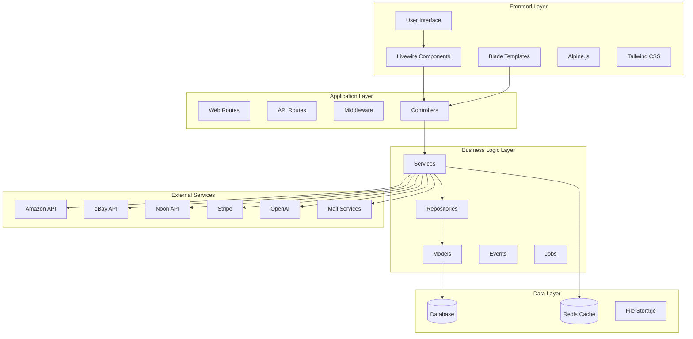

## 🏛️ Architectural Layers

### 1. Presentation Layer
- **Location**: `resources/views/`, `resources/js/`, `resources/css/`
- **Technologies**: Blade Templates, Livewire, Alpine.js, Tailwind CSS
- **Responsibilities**: User interface, client-side interactions, responsive design

### 2. Application Layer
- **Location**: `app/Http/Controllers/`, `routes/`
- **Components**: Controllers, Middleware, Routes, Requests, Resources
- **Responsibilities**: HTTP handling, request validation, response formatting

### 3. Business Logic Layer
- **Location**: `app/Services/`, `app/Repositories/`, `app/Models/`
- **Components**: Services, Repositories, Domain Models, Events, Jobs
- **Responsibilities**: Core business logic, data access patterns, domain rules

### 4. Infrastructure Layer
- **Location**: `app/Providers/`, `config/`, `database/`
- **Components**: Service Providers, Configuration, Migrations, Factories
- **Responsibilities**: Framework configuration, external service integration

## 🎨 Architectural Patterns

### 1. Model-View-Controller (MVC)
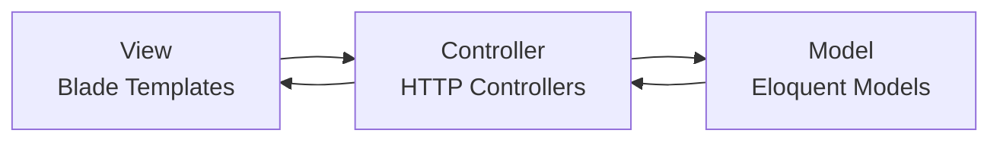

### 2. Repository Pattern
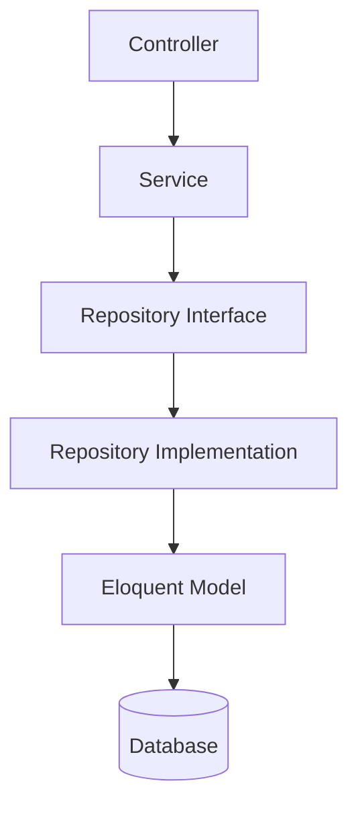

### 3. Service Layer Pattern
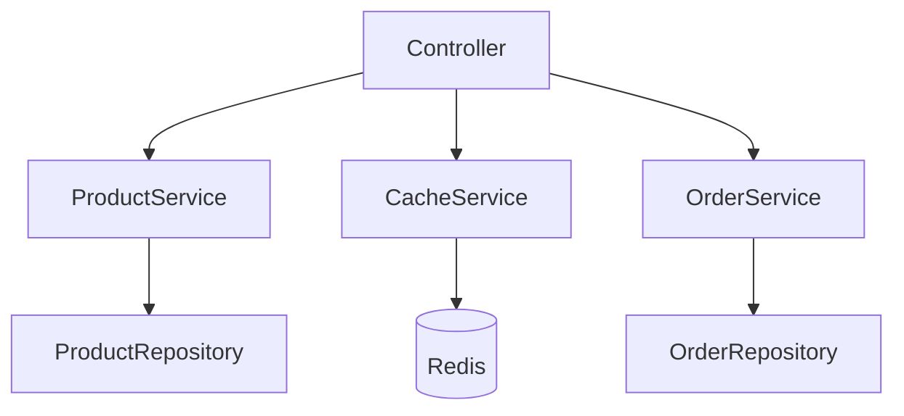

### 4. Strategy Pattern
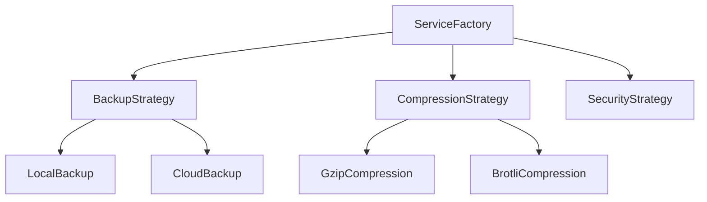

### 5. Adapter Pattern
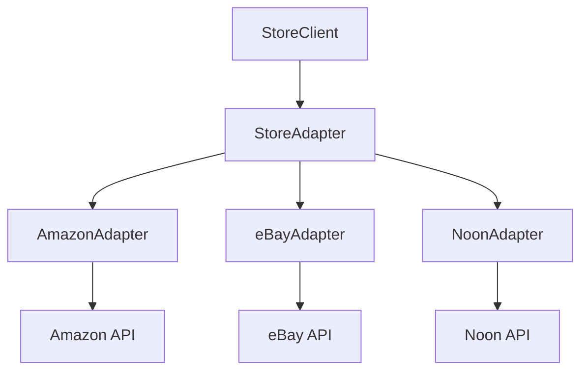

## 🛠️ Technology Stack

### Backend Framework
- **Laravel 11.x**: Core framework
- **PHP 8.3+**: Programming language
- **Composer**: Dependency management

### Frontend Technologies
- **Livewire**: Dynamic interactions
- **Blade**: Template engine
- **Alpine.js**: Lightweight JavaScript
- **Tailwind CSS**: Utility-first CSS
- **Vite**: Build tool and dev server

### Database & Caching
- **MySQL/PostgreSQL**: Primary database
- **Redis**: Caching and sessions
- **Predis**: Redis client for PHP

### Testing Framework
- **PHPUnit**: Backend testing
- **Vitest**: Frontend testing
- **Laravel Dusk**: End-to-end testing

### Security & Monitoring
- **Sentry**: Error monitoring
- **Spatie Laravel Permission**: Role-based access
- **Laravel Backup**: Automated backups

### API & Documentation
- **L5 Swagger**: API documentation
- **Guzzle HTTP**: HTTP client

## 🔗 External Integrations

### E-commerce Platforms
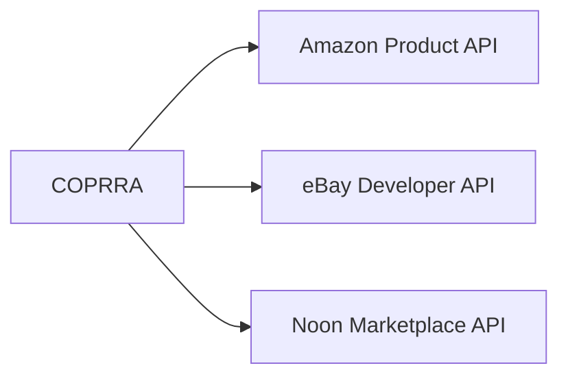

### Payment Gateways
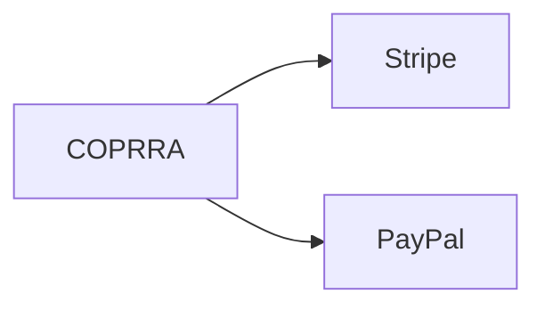

### Communication Services
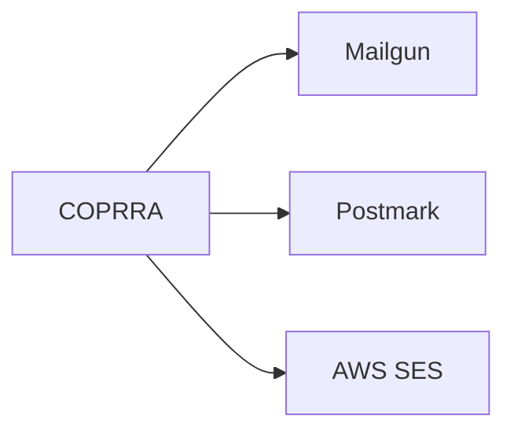

### AI & Analytics
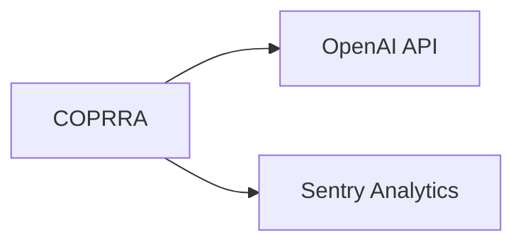

## 📁 Directory Structure

```
COPRRA/
├── app/
│   ├── COPRRA/                 # Custom domain logic
│   │   ├── Console/           # Custom commands
│   │   ├── Contracts/         # Interfaces
│   │   ├── Helpers/           # Utility functions
│   │   ├── Models/            # Domain models
│   │   └── Services/          # Business services
│   ├── Http/
│   │   ├── Controllers/       # Request handlers
│   │   ├── Middleware/        # HTTP middleware
│   │   ├── Requests/          # Form requests
│   │   └── Resources/         # API resources
│   ├── Models/                # Eloquent models
│   ├── Services/              # Application services
│   ├── Repositories/          # Data access layer
│   ├── Providers/             # Service providers
│   └── Jobs/                  # Background jobs
├── resources/
│   ├── views/                 # Blade templates
│   ├── js/                    # Frontend JavaScript
│   └── css/                   # Stylesheets
├── routes/
│   ├── web.php               # Web routes
│   ├── api.php               # API routes
│   └── console.php           # Console commands
├── database/
│   ├── migrations/           # Database schema
│   ├── factories/            # Model factories
│   └── seeders/              # Data seeders
└── config/                   # Configuration files
```

## 🔄 Data Flow Architecture

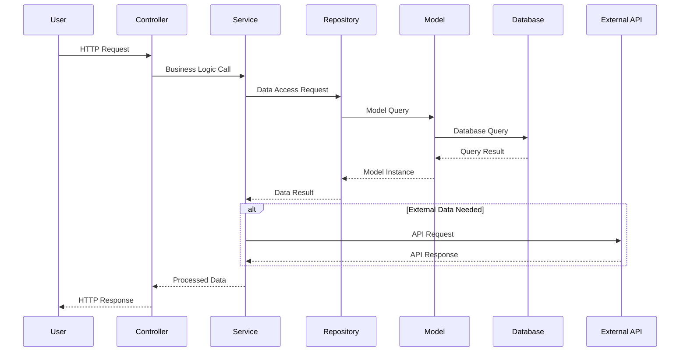

## 🚀 Key Features Architecture

### Product Comparison Engine
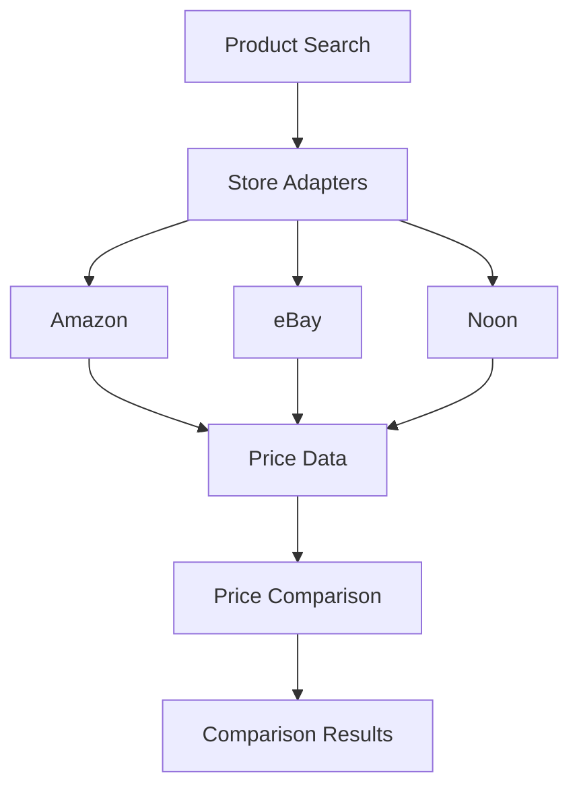

### Caching Strategy
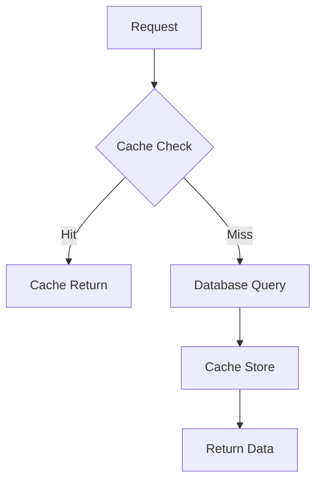

### Authentication & Authorization
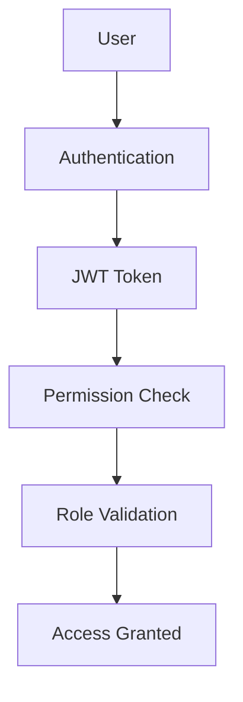

## 📊 Performance Considerations

### Optimization Strategies
1. **Database Indexing**: Strategic indexes on frequently queried columns
2. **Query Optimization**: Eager loading, query builders
3. **Caching Layers**: Redis for sessions, application cache
4. **CDN Integration**: Static asset delivery
5. **Image Optimization**: Intervention Image processing
6. **Background Jobs**: Queue system for heavy operations

### Scalability Features
1. **Horizontal Scaling**: Load balancer ready
2. **Database Sharding**: Prepared for multi-database setup
3. **Microservices Ready**: Service-oriented architecture
4. **API Rate Limiting**: Built-in throttling
5. **Monitoring**: Comprehensive error tracking

## 🔒 Security Architecture

### Security Layers
1. **Input Validation**: Form requests and middleware
2. **Authentication**: Multi-factor authentication support
3. **Authorization**: Role-based access control
4. **Data Protection**: Encryption at rest and in transit
5. **API Security**: Rate limiting and token validation
6. **Monitoring**: Security event logging

## 📈 Monitoring & Analytics

### Observability Stack
1. **Error Tracking**: Sentry integration
2. **Performance Monitoring**: Laravel Telescope
3. **Log Management**: Structured logging
4. **Health Checks**: System status endpoints
5. **Analytics**: Custom event tracking

## 🎯 Architectural Strengths

1. **Separation of Concerns**: Clear layer boundaries
2. **Testability**: Comprehensive testing strategy
3. **Maintainability**: Clean code principles
4. **Scalability**: Horizontal scaling ready
5. **Extensibility**: Plugin architecture support
6. **Security**: Multi-layered security approach

## ⚠️ Potential Improvements

1. **API Versioning**: Implement comprehensive API versioning
2. **Event Sourcing**: Consider for audit trails
3. **CQRS Pattern**: For complex read/write operations
4. **Circuit Breaker**: For external API resilience
5. **Container Orchestration**: Docker/Kubernetes deployment

## 📝 Initial Observations

### Positive Aspects
- ✅ Well-structured Laravel application
- ✅ Clear separation of concerns
- ✅ Comprehensive testing setup
- ✅ Modern frontend stack
- ✅ Robust external integrations
- ✅ Security-first approach

### Areas for Enhancement
- 🔄 API documentation completeness
- 🔄 Performance monitoring expansion
- 🔄 Container deployment strategy
- 🔄 Advanced caching strategies
- 🔄 Microservices migration path

---

**Generated by**: Senior Software Architecture Inspector Agent  
**Date**: January 2025  
**Version**: 1.0  
**Status**: Initial Architectural Assessment Complete