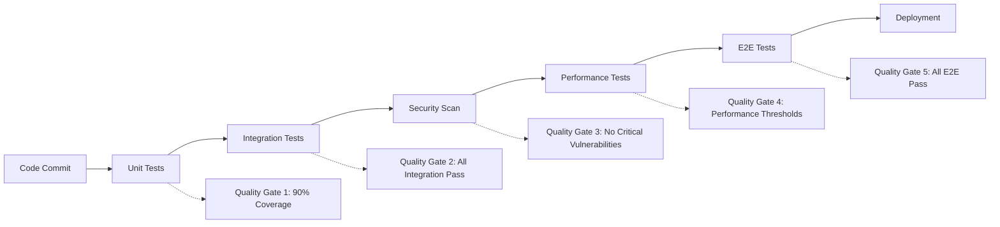

# COPRRA Testing Strategy Documentation

## Table of Contents
1. [Overview](#overview)
2. [Testing Philosophy](#testing-philosophy)
3. [Testing Pyramid](#testing-pyramid)
4. [Test Types & Methodologies](#test-types--methodologies)
5. [Testing Frameworks & Tools](#testing-frameworks--tools)
6. [Test Automation Strategy](#test-automation-strategy)
7. [CI/CD Integration](#cicd-integration)
8. [Performance Testing](#performance-testing)
9. [Security Testing](#security-testing)
10. [API Testing](#api-testing)
11. [Frontend Testing](#frontend-testing)
12. [Database Testing](#database-testing)
13. [Test Data Management](#test-data-management)
14. [Test Environment Strategy](#test-environment-strategy)
15. [Quality Metrics & Reporting](#quality-metrics--reporting)
16. [Best Practices](#best-practices)

## Overview

This document outlines the comprehensive testing strategy for COPRRA, covering all aspects of quality assurance from unit testing to end-to-end validation. Our testing approach ensures high code quality, reliability, security, and performance across all components of the platform.

### Testing Objectives
- **Quality Assurance**: Ensure code meets functional and non-functional requirements
- **Risk Mitigation**: Identify and prevent defects before production deployment
- **Regression Prevention**: Maintain system stability during continuous development
- **Performance Validation**: Ensure optimal system performance under various conditions
- **Security Assurance**: Validate security controls and identify vulnerabilities
- **User Experience**: Ensure seamless user interactions across all interfaces

## Testing Philosophy

### Core Principles
1. **Shift-Left Testing**: Integrate testing early in the development lifecycle
2. **Test-Driven Development (TDD)**: Write tests before implementation
3. **Behavior-Driven Development (BDD)**: Focus on business behavior and user stories
4. **Continuous Testing**: Automated testing throughout the CI/CD pipeline
5. **Risk-Based Testing**: Prioritize testing based on risk assessment
6. **Exploratory Testing**: Combine scripted and exploratory testing approaches

### Quality Gates


## Testing Pyramid

### Test Distribution Strategy
```
    /\
   /  \     E2E Tests (5%)
  /____\    - User journey validation
 /      \   - Cross-browser testing
/________\  - Integration scenarios

/          \  Integration Tests (25%)
/____________\ - API testing
               - Service integration
               - Database integration

/              \  Unit Tests (70%)
/________________\ - Function testing
                   - Class testing
                   - Component testing
```

### Coverage Targets
- **Unit Tests**: 90% code coverage minimum
- **Integration Tests**: 80% API endpoint coverage
- **E2E Tests**: 100% critical user journey coverage
- **Security Tests**: 100% OWASP Top 10 coverage
- **Performance Tests**: 100% critical path coverage

## Test Types & Methodologies

### 1. Unit Testing

#### Scope
- Individual functions and methods
- Class behavior and state management
- Component isolation testing
- Business logic validation

#### Implementation Example
```php
<?php
// tests/Unit/Services/UserServiceTest.php

namespace Tests\Unit\Services;

use App\Services\UserService;
use App\Models\User;
use Tests\TestCase;
use Mockery;

class UserServiceTest extends TestCase
{
    private UserService $userService;
    
    protected function setUp(): void
    {
        parent::setUp();
        $this->userService = new UserService();
    }
    
    /** @test */
    public function it_creates_user_with_valid_data()
    {
        // Arrange
        $userData = [
            'name' => 'John Doe',
            'email' => 'john@example.com',
            'password' => 'secure_password'
        ];
        
        // Act
        $user = $this->userService->createUser($userData);
        
        // Assert
        $this->assertInstanceOf(User::class, $user);
        $this->assertEquals('John Doe', $user->name);
        $this->assertEquals('john@example.com', $user->email);
        $this->assertTrue(Hash::check('secure_password', $user->password));
    }
    
    /** @test */
    public function it_throws_exception_for_duplicate_email()
    {
        // Arrange
        User::factory()->create(['email' => 'existing@example.com']);
        
        $userData = [
            'name' => 'Jane Doe',
            'email' => 'existing@example.com',
            'password' => 'password'
        ];
        
        // Act & Assert
        $this->expectException(ValidationException::class);
        $this->userService->createUser($userData);
    }
    
    /** @test */
    public function it_validates_user_permissions()
    {
        // Arrange
        $user = User::factory()->create();
        $permission = 'admin.access';
        
        // Mock permission check
        $user->shouldReceive('hasPermission')
             ->with($permission)
             ->andReturn(true);
        
        // Act
        $hasPermission = $this->userService->checkPermission($user, $permission);
        
        // Assert
        $this->assertTrue($hasPermission);
    }
}
```

### 2. Integration Testing

#### API Integration Tests
```php
<?php
// tests/Feature/Api/ProjectApiTest.php

namespace Tests\Feature\Api;

use App\Models\User;
use App\Models\Project;
use Tests\TestCase;
use Laravel\Sanctum\Sanctum;

class ProjectApiTest extends TestCase
{
    /** @test */
    public function authenticated_user_can_create_project()
    {
        // Arrange
        $user = User::factory()->create();
        Sanctum::actingAs($user);
        
        $projectData = [
            'name' => 'Test Project',
            'description' => 'A test project',
            'repository_url' => 'https://github.com/user/repo',
            'language' => 'php'
        ];
        
        // Act
        $response = $this->postJson('/api/projects', $projectData);
        
        // Assert
        $response->assertStatus(201)
                ->assertJsonStructure([
                    'data' => [
                        'id',
                        'name',
                        'description',
                        'repository_url',
                        'language',
                        'created_at',
                        'updated_at'
                    ]
                ]);
        
        $this->assertDatabaseHas('projects', [
            'name' => 'Test Project',
            'user_id' => $user->id
        ]);
    }
    
    /** @test */
    public function user_can_retrieve_their_projects()
    {
        // Arrange
        $user = User::factory()->create();
        $projects = Project::factory()->count(3)->create(['user_id' => $user->id]);
        Sanctum::actingAs($user);
        
        // Act
        $response = $this->getJson('/api/projects');
        
        // Assert
        $response->assertStatus(200)
                ->assertJsonCount(3, 'data')
                ->assertJsonStructure([
                    'data' => [
                        '*' => ['id', 'name', 'description']
                    ],
                    'pagination' => [
                        'current_page',
                        'total_pages',
                        'total_items'
                    ]
                ]);
    }
    
    /** @test */
    public function project_analysis_can_be_triggered()
    {
        // Arrange
        $user = User::factory()->create();
        $project = Project::factory()->create(['user_id' => $user->id]);
        Sanctum::actingAs($user);
        
        // Act
        $response = $this->postJson("/api/projects/{$project->id}/analysis", [
            'type' => 'full',
            'options' => [
                'ai_suggestions' => true,
                'deep_analysis' => true
            ]
        ]);
        
        // Assert
        $response->assertStatus(201)
                ->assertJsonStructure([
                    'analysis_id',
                    'status',
                    'estimated_duration',
                    'created_at'
                ]);
        
        $this->assertDatabaseHas('analyses', [
            'project_id' => $project->id,
            'type' => 'full',
            'status' => 'queued'
        ]);
    }
}
```

#### Database Integration Tests
```php
<?php
// tests/Feature/Database/UserRepositoryTest.php

namespace Tests\Feature\Database;

use App\Repositories\UserRepository;
use App\Models\User;
use Tests\TestCase;
use Illuminate\Foundation\Testing\RefreshDatabase;

class UserRepositoryTest extends TestCase
{
    use RefreshDatabase;
    
    private UserRepository $userRepository;
    
    protected function setUp(): void
    {
        parent::setUp();
        $this->userRepository = new UserRepository();
    }
    
    /** @test */
    public function it_can_find_users_by_role()
    {
        // Arrange
        $adminUsers = User::factory()->count(2)->create(['role' => 'admin']);
        $regularUsers = User::factory()->count(3)->create(['role' => 'user']);
        
        // Act
        $foundAdmins = $this->userRepository->findByRole('admin');
        
        // Assert
        $this->assertCount(2, $foundAdmins);
        $foundAdmins->each(function ($user) {
            $this->assertEquals('admin', $user->role);
        });
    }
    
    /** @test */
    public function it_can_search_users_with_filters()
    {
        // Arrange
        User::factory()->create([
            'name' => 'John Doe',
            'email' => 'john@example.com',
            'status' => 'active'
        ]);
        
        User::factory()->create([
            'name' => 'Jane Smith',
            'email' => 'jane@example.com',
            'status' => 'inactive'
        ]);
        
        // Act
        $results = $this->userRepository->search([
            'name' => 'John',
            'status' => 'active'
        ]);
        
        // Assert
        $this->assertCount(1, $results);
        $this->assertEquals('John Doe', $results->first()->name);
    }
}
```

### 3. End-to-End Testing

#### Browser Testing with Laravel Dusk
```php
<?php
// tests/Browser/ProjectManagementTest.php

namespace Tests\Browser;

use App\Models\User;
use Laravel\Dusk\Browser;
use Tests\DuskTestCase;

class ProjectManagementTest extends DuskTestCase
{
    /** @test */
    public function user_can_create_and_manage_project()
    {
        $user = User::factory()->create();
        
        $this->browse(function (Browser $browser) use ($user) {
            $browser->loginAs($user)
                   ->visit('/dashboard')
                   ->assertSee('Dashboard')
                   
                   // Create new project
                   ->click('@create-project-btn')
                   ->waitFor('@project-form')
                   ->type('@project-name', 'My Test Project')
                   ->type('@project-description', 'A comprehensive test project')
                   ->select('@project-language', 'php')
                   ->type('@repository-url', 'https://github.com/user/test-repo')
                   ->click('@submit-project')
                   
                   // Verify project creation
                   ->waitForText('Project created successfully')
                   ->assertSee('My Test Project')
                   
                   // Trigger analysis
                   ->click('@analyze-project')
                   ->waitFor('@analysis-options')
                   ->check('@deep-analysis')
                   ->check('@ai-suggestions')
                   ->click('@start-analysis')
                   
                   // Verify analysis started
                   ->waitForText('Analysis started')
                   ->assertSee('Analysis in progress')
                   
                   // Check analysis results (mock completion)
                   ->visit('/projects/1/analysis/1')
                   ->waitForText('Analysis completed')
                   ->assertSee('Code Quality Score')
                   ->assertSee('Security Score')
                   ->assertSee('Performance Score');
        });
    }
    
    /** @test */
    public function user_can_navigate_through_ai_features()
    {
        $user = User::factory()->create();
        
        $this->browse(function (Browser $browser) use ($user) {
            $browser->loginAs($user)
                   ->visit('/ai/code-review')
                   
                   // Test AI code review
                   ->type('@code-input', '<?php\nclass Example {\n    public function test() {\n        return "hello";\n    }\n}')
                   ->select('@review-type', 'comprehensive')
                   ->click('@submit-review')
                   ->waitForText('AI Review Results')
                   ->assertSee('Suggestions')
                   ->assertSee('Code Quality')
                   
                   // Test AI code generation
                   ->visit('/ai/generate')
                   ->type('@prompt-input', 'Create a Laravel controller for user management')
                   ->check('@include-tests')
                   ->click('@generate-code')
                   ->waitForText('Generated Code')
                   ->assertSee('class UserController')
                   ->assertSee('public function index()');
        });
    }
}
```

### 4. Performance Testing

#### Load Testing with Artillery
```yaml
# artillery-config.yml
config:
  target: 'https://api.coprra.com'
  phases:
    - duration: 60
      arrivalRate: 10
      name: "Warm up"
    - duration: 300
      arrivalRate: 50
      name: "Sustained load"
    - duration: 120
      arrivalRate: 100
      name: "Peak load"
  defaults:
    headers:
      Authorization: 'Bearer {{ $processEnvironment.API_TOKEN }}'
      Content-Type: 'application/json'

scenarios:
  - name: "API Load Test"
    weight: 70
    flow:
      - get:
          url: "/api/projects"
          capture:
            - json: "$.data[0].id"
              as: "projectId"
      - post:
          url: "/api/projects/{{ projectId }}/analysis"
          json:
            type: "quick"
            options:
              ai_suggestions: false
      - get:
          url: "/api/projects/{{ projectId }}/metrics"

  - name: "AI Features Load Test"
    weight: 30
    flow:
      - post:
          url: "/api/ai/review"
          json:
            code: "<?php\nclass Test {\n    public function example() {\n        return 'test';\n    }\n}"
            review_type: "quick"
      - post:
          url: "/api/ai/optimize"
          json:
            code: "SELECT * FROM users WHERE active = 1"
            optimization_type: "query"
```

#### Performance Test Implementation
```php
<?php
// tests/Performance/ApiPerformanceTest.php

namespace Tests\Performance;

use Tests\TestCase;
use App\Models\User;
use Laravel\Sanctum\Sanctum;

class ApiPerformanceTest extends TestCase
{
    /** @test */
    public function api_endpoints_meet_performance_requirements()
    {
        $user = User::factory()->create();
        Sanctum::actingAs($user);
        
        // Test project listing performance
        $startTime = microtime(true);
        $response = $this->getJson('/api/projects');
        $endTime = microtime(true);
        
        $responseTime = ($endTime - $startTime) * 1000; // Convert to milliseconds
        
        $response->assertStatus(200);
        $this->assertLessThan(500, $responseTime, 'Project listing should respond within 500ms');
        
        // Test analysis trigger performance
        $project = Project::factory()->create(['user_id' => $user->id]);
        
        $startTime = microtime(true);
        $response = $this->postJson("/api/projects/{$project->id}/analysis", [
            'type' => 'quick'
        ]);
        $endTime = microtime(true);
        
        $responseTime = ($endTime - $startTime) * 1000;
        
        $response->assertStatus(201);
        $this->assertLessThan(1000, $responseTime, 'Analysis trigger should respond within 1000ms');
    }
    
    /** @test */
    public function database_queries_are_optimized()
    {
        $user = User::factory()->create();
        $projects = Project::factory()->count(100)->create(['user_id' => $user->id]);
        
        // Enable query logging
        DB::enableQueryLog();
        
        Sanctum::actingAs($user);
        $response = $this->getJson('/api/projects?limit=20');
        
        $queries = DB::getQueryLog();
        
        $response->assertStatus(200);
        
        // Should not exceed N+1 query limit
        $this->assertLessThanOrEqual(5, count($queries), 'Should not have N+1 query problems');
        
        // Check for expensive queries
        foreach ($queries as $query) {
            $this->assertLessThan(100, $query['time'], 'Individual queries should execute within 100ms');
        }
    }
}
```

### 5. Security Testing

#### Security Test Suite
```php
<?php
// tests/Security/SecurityTest.php

namespace Tests\Security;

use Tests\TestCase;
use App\Models\User;
use Laravel\Sanctum\Sanctum;

class SecurityTest extends TestCase
{
    /** @test */
    public function api_requires_authentication()
    {
        $response = $this->getJson('/api/projects');
        $response->assertStatus(401);
        
        $response = $this->postJson('/api/projects', [
            'name' => 'Test Project'
        ]);
        $response->assertStatus(401);
    }
    
    /** @test */
    public function users_cannot_access_other_users_data()
    {
        $user1 = User::factory()->create();
        $user2 = User::factory()->create();
        
        $project = Project::factory()->create(['user_id' => $user1->id]);
        
        Sanctum::actingAs($user2);
        
        $response = $this->getJson("/api/projects/{$project->id}");
        $response->assertStatus(403);
        
        $response = $this->putJson("/api/projects/{$project->id}", [
            'name' => 'Updated Name'
        ]);
        $response->assertStatus(403);
    }
    
    /** @test */
    public function api_validates_input_data()
    {
        $user = User::factory()->create();
        Sanctum::actingAs($user);
        
        // Test SQL injection attempt
        $response = $this->postJson('/api/projects', [
            'name' => "'; DROP TABLE projects; --",
            'description' => 'Test'
        ]);
        
        $response->assertStatus(422);
        $this->assertDatabaseMissing('projects', [
            'name' => "'; DROP TABLE projects; --"
        ]);
        
        // Test XSS attempt
        $response = $this->postJson('/api/projects', [
            'name' => '<script>alert("xss")</script>',
            'description' => 'Test'
        ]);
        
        $response->assertStatus(422);
    }
    
    /** @test */
    public function api_implements_rate_limiting()
    {
        $user = User::factory()->create();
        Sanctum::actingAs($user);
        
        // Make multiple requests rapidly
        for ($i = 0; $i < 100; $i++) {
            $response = $this->getJson('/api/projects');
            
            if ($response->status() === 429) {
                $this->assertTrue(true, 'Rate limiting is working');
                return;
            }
        }
        
        $this->fail('Rate limiting should have been triggered');
    }
}
```

#### OWASP Security Testing
```bash
#!/bin/bash
# security-tests.sh

echo "Running OWASP Security Tests..."

# 1. Dependency Check
echo "Checking for vulnerable dependencies..."
composer audit
npm audit

# 2. Static Analysis Security Testing (SAST)
echo "Running static security analysis..."
./vendor/bin/phpstan analyse --level=8 --configuration=phpstan-security.neon

# 3. SQL Injection Testing
echo "Testing for SQL injection vulnerabilities..."
sqlmap -u "http://localhost/api/projects?id=1" --cookie="session=test" --batch

# 4. XSS Testing
echo "Testing for XSS vulnerabilities..."
python3 xsser.py -u "http://localhost/search?q=test" --auto

# 5. CSRF Testing
echo "Testing CSRF protection..."
curl -X POST http://localhost/api/projects \
  -H "Content-Type: application/json" \
  -d '{"name":"test"}' \
  --cookie "session=valid_session"

# 6. Authentication Testing
echo "Testing authentication mechanisms..."
curl -X GET http://localhost/api/projects
curl -X GET http://localhost/api/projects -H "Authorization: Bearer invalid_token"

# 7. Authorization Testing
echo "Testing authorization controls..."
# Test with different user roles and permissions

echo "Security testing completed!"
```

## Testing Frameworks & Tools

### Backend Testing Stack
```json
{
  "php_testing": {
    "unit_testing": "PHPUnit 10.x",
    "feature_testing": "Laravel Testing",
    "browser_testing": "Laravel Dusk",
    "api_testing": "Pest PHP",
    "mocking": "Mockery",
    "factories": "Laravel Factories"
  },
  "static_analysis": {
    "code_quality": "PHPStan",
    "security": "Psalm Security",
    "style": "PHP CS Fixer"
  }
}
```

### Frontend Testing Stack
```json
{
  "javascript_testing": {
    "unit_testing": "Jest",
    "component_testing": "Vue Test Utils",
    "e2e_testing": "Cypress",
    "visual_testing": "Percy",
    "accessibility": "axe-core"
  },
  "build_tools": {
    "test_runner": "Vitest",
    "coverage": "c8",
    "mocking": "MSW"
  }
}
```

### Performance Testing Tools
```yaml
load_testing:
  - artillery
  - k6
  - jmeter

profiling:
  - xdebug
  - blackfire
  - new_relic

monitoring:
  - datadog
  - prometheus
  - grafana
```

## Test Automation Strategy

### Continuous Integration Pipeline
```yaml
# .github/workflows/test.yml
name: Test Suite

on:
  push:
    branches: [main, develop]
  pull_request:
    branches: [main]

jobs:
  unit-tests:
    runs-on: ubuntu-latest
    
    services:
      mysql:
        image: mysql:8.0
        env:
          MYSQL_ROOT_PASSWORD: password
          MYSQL_DATABASE: coprra_test
        options: >-
          --health-cmd="mysqladmin ping"
          --health-interval=10s
          --health-timeout=5s
          --health-retries=3
      
      redis:
        image: redis:7
        options: >-
          --health-cmd="redis-cli ping"
          --health-interval=10s
          --health-timeout=5s
          --health-retries=3

    steps:
      - uses: actions/checkout@v3
      
      - name: Setup PHP
        uses: shivammathur/setup-php@v2
        with:
          php-version: '8.1'
          extensions: mbstring, xml, ctype, iconv, intl, pdo_mysql, redis
          coverage: xdebug
      
      - name: Install dependencies
        run: composer install --prefer-dist --no-progress
      
      - name: Run unit tests
        run: |
          php artisan test --testsuite=Unit --coverage-clover coverage.xml
          php artisan test --testsuite=Feature --parallel
      
      - name: Upload coverage
        uses: codecov/codecov-action@v3
        with:
          file: ./coverage.xml

  integration-tests:
    needs: unit-tests
    runs-on: ubuntu-latest
    
    steps:
      - uses: actions/checkout@v3
      
      - name: Setup environment
        run: |
          cp .env.testing .env
          php artisan key:generate
          php artisan migrate --force
      
      - name: Run integration tests
        run: php artisan test --testsuite=Integration

  e2e-tests:
    needs: integration-tests
    runs-on: ubuntu-latest
    
    steps:
      - uses: actions/checkout@v3
      
      - name: Setup Chrome
        uses: browser-actions/setup-chrome@latest
      
      - name: Run Dusk tests
        run: |
          php artisan serve &
          php artisan dusk
      
      - name: Upload Dusk screenshots
        uses: actions/upload-artifact@v3
        if: failure()
        with:
          name: dusk-screenshots
          path: tests/Browser/screenshots

  security-tests:
    runs-on: ubuntu-latest
    
    steps:
      - uses: actions/checkout@v3
      
      - name: Run security audit
        run: |
          composer audit
          npm audit
      
      - name: Run SAST scan
        uses: github/super-linter@v4
        env:
          DEFAULT_BRANCH: main
          GITHUB_TOKEN: ${{ secrets.GITHUB_TOKEN }}

  performance-tests:
    needs: integration-tests
    runs-on: ubuntu-latest
    
    steps:
      - uses: actions/checkout@v3
      
      - name: Setup application
        run: |
          php artisan serve &
          sleep 10
      
      - name: Run load tests
        run: |
          npm install -g artillery
          artillery run artillery-config.yml
      
      - name: Performance regression check
        run: |
          php artisan test --testsuite=Performance
```

### Test Data Management

#### Database Seeding Strategy
```php
<?php
// database/seeders/TestDataSeeder.php

namespace Database\Seeders;

use Illuminate\Database\Seeder;
use App\Models\User;
use App\Models\Project;
use App\Models\Analysis;

class TestDataSeeder extends Seeder
{
    public function run()
    {
        // Create test users with different roles
        $admin = User::factory()->create([
            'email' => 'admin@test.com',
            'role' => 'admin'
        ]);
        
        $developer = User::factory()->create([
            'email' => 'developer@test.com',
            'role' => 'developer'
        ]);
        
        $viewer = User::factory()->create([
            'email' => 'viewer@test.com',
            'role' => 'viewer'
        ]);
        
        // Create test projects
        $projects = collect([
            [
                'name' => 'Laravel E-commerce',
                'language' => 'php',
                'framework' => 'laravel',
                'repository_url' => 'https://github.com/test/laravel-ecommerce'
            ],
            [
                'name' => 'React Dashboard',
                'language' => 'javascript',
                'framework' => 'react',
                'repository_url' => 'https://github.com/test/react-dashboard'
            ],
            [
                'name' => 'Python API',
                'language' => 'python',
                'framework' => 'django',
                'repository_url' => 'https://github.com/test/python-api'
            ]
        ]);
        
        $projects->each(function ($projectData) use ($developer) {
            $project = Project::factory()->create(array_merge($projectData, [
                'user_id' => $developer->id
            ]));
            
            // Create sample analyses
            Analysis::factory()->count(3)->create([
                'project_id' => $project->id,
                'status' => 'completed'
            ]);
        });
    }
}
```

#### Test Data Factories
```php
<?php
// database/factories/ProjectFactory.php

namespace Database\Factories;

use App\Models\Project;
use App\Models\User;
use Illuminate\Database\Eloquent\Factories\Factory;

class ProjectFactory extends Factory
{
    protected $model = Project::class;
    
    public function definition()
    {
        return [
            'name' => $this->faker->words(3, true),
            'description' => $this->faker->paragraph(),
            'repository_url' => $this->faker->url(),
            'language' => $this->faker->randomElement(['php', 'javascript', 'python', 'java']),
            'framework' => $this->faker->randomElement(['laravel', 'react', 'django', 'spring']),
            'status' => $this->faker->randomElement(['active', 'archived', 'draft']),
            'user_id' => User::factory(),
            'settings' => [
                'auto_analysis' => $this->faker->boolean(),
                'security_scanning' => $this->faker->boolean(),
                'performance_monitoring' => $this->faker->boolean()
            ]
        ];
    }
    
    public function active()
    {
        return $this->state(function (array $attributes) {
            return [
                'status' => 'active'
            ];
        });
    }
    
    public function withAnalysis()
    {
        return $this->afterCreating(function (Project $project) {
            Analysis::factory()->count(3)->create([
                'project_id' => $project->id
            ]);
        });
    }
}
```

### Test Environment Strategy

#### Environment Configuration
```bash
# .env.testing
APP_ENV=testing
APP_DEBUG=true
APP_KEY=base64:test-key-for-testing-only

DB_CONNECTION=mysql
DB_HOST=127.0.0.1
DB_PORT=3306
DB_DATABASE=coprra_test
DB_USERNAME=test_user
DB_PASSWORD=test_password

CACHE_DRIVER=array
QUEUE_CONNECTION=sync
SESSION_DRIVER=array

MAIL_MAILER=array

# Disable external services in testing
AI_SERVICE_ENABLED=false
EXTERNAL_API_ENABLED=false
ANALYTICS_ENABLED=false
```

#### Docker Test Environment
```yaml
# docker-compose.test.yml
version: '3.8'

services:
  app-test:
    build:
      context: .
      dockerfile: Dockerfile.test
    environment:
      - APP_ENV=testing
      - DB_HOST=mysql-test
      - REDIS_HOST=redis-test
    depends_on:
      - mysql-test
      - redis-test
    volumes:
      - .:/var/www/html

  mysql-test:
    image: mysql:8.0
    environment:
      MYSQL_ROOT_PASSWORD: test_password
      MYSQL_DATABASE: coprra_test
      MYSQL_USER: test_user
      MYSQL_PASSWORD: test_password
    tmpfs:
      - /var/lib/mysql

  redis-test:
    image: redis:7-alpine
    command: redis-server --save ""
```

## Quality Metrics & Reporting

### Coverage Reporting
```php
<?php
// tests/TestCase.php

namespace Tests;

use Illuminate\Foundation\Testing\TestCase as BaseTestCase;

abstract class TestCase extends BaseTestCase
{
    use CreatesApplication;
    
    protected function setUp(): void
    {
        parent::setUp();
        
        // Start code coverage if enabled
        if (env('ENABLE_COVERAGE', false)) {
            $this->startCodeCoverage();
        }
    }
    
    protected function tearDown(): void
    {
        // Stop code coverage if enabled
        if (env('ENABLE_COVERAGE', false)) {
            $this->stopCodeCoverage();
        }
        
        parent::tearDown();
    }
    
    private function startCodeCoverage()
    {
        if (extension_loaded('xdebug')) {
            xdebug_start_code_coverage(XDEBUG_CC_UNUSED | XDEBUG_CC_DEAD_CODE);
        }
    }
    
    private function stopCodeCoverage()
    {
        if (extension_loaded('xdebug')) {
            $coverage = xdebug_get_code_coverage();
            // Process coverage data
            $this->processCoverageData($coverage);
            xdebug_stop_code_coverage();
        }
    }
}
```

### Test Reporting Dashboard
```php
<?php
// app/Console/Commands/GenerateTestReport.php

namespace App\Console\Commands;

use Illuminate\Console\Command;

class GenerateTestReport extends Command
{
    protected $signature = 'test:report {--format=html}';
    protected $description = 'Generate comprehensive test report';
    
    public function handle()
    {
        $this->info('Generating test report...');
        
        // Run all test suites and collect metrics
        $results = [
            'unit' => $this->runTestSuite('Unit'),
            'feature' => $this->runTestSuite('Feature'),
            'browser' => $this->runTestSuite('Browser'),
            'performance' => $this->runPerformanceTests(),
            'security' => $this->runSecurityTests()
        ];
        
        // Generate coverage report
        $coverage = $this->generateCoverageReport();
        
        // Create comprehensive report
        $report = $this->createReport($results, $coverage);
        
        // Output report
        $format = $this->option('format');
        $this->outputReport($report, $format);
        
        $this->info('Test report generated successfully!');
    }
    
    private function runTestSuite(string $suite): array
    {
        $output = shell_exec("php artisan test --testsuite={$suite} --log-junit junit-{$suite}.xml");
        
        return [
            'suite' => $suite,
            'tests_run' => $this->extractTestCount($output),
            'failures' => $this->extractFailureCount($output),
            'execution_time' => $this->extractExecutionTime($output)
        ];
    }
    
    private function generateCoverageReport(): array
    {
        shell_exec('php artisan test --coverage-clover coverage.xml');
        
        $coverage = simplexml_load_file('coverage.xml');
        
        return [
            'lines_covered' => (int) $coverage->project->metrics['coveredstatements'],
            'lines_total' => (int) $coverage->project->metrics['statements'],
            'percentage' => round(
                ((int) $coverage->project->metrics['coveredstatements'] / 
                 (int) $coverage->project->metrics['statements']) * 100, 2
            )
        ];
    }
}
```

## Best Practices

### 1. Test Organization
```
tests/
├── Unit/                    # Unit tests
│   ├── Models/
│   ├── Services/
│   └── Helpers/
├── Feature/                 # Integration tests
│   ├── Api/
│   ├── Web/
│   └── Database/
├── Browser/                 # E2E tests
│   ├── Authentication/
│   ├── ProjectManagement/
│   └── AiFeatures/
├── Performance/             # Performance tests
├── Security/                # Security tests
└── Support/                 # Test utilities
    ├── Traits/
    ├── Factories/
    └── Helpers/
```

### 2. Test Naming Conventions
```php
// Good test names
public function it_creates_user_with_valid_data()
public function it_throws_exception_for_invalid_email()
public function authenticated_user_can_access_dashboard()
public function guest_user_is_redirected_to_login()

// Bad test names
public function testUser()
public function test1()
public function userCreation()
```

### 3. Test Data Management
```php
// Use factories for test data
$user = User::factory()->create();
$project = Project::factory()->withAnalysis()->create(['user_id' => $user->id]);

// Use specific test data when needed
$user = User::factory()->create([
    'email' => 'specific@test.com',
    'role' => 'admin'
]);

// Clean up after tests
protected function tearDown(): void
{
    // Clean up any external resources
    Storage::fake('s3')->deleteDirectory('test-uploads');
    parent::tearDown();
}
```

### 4. Mocking External Services
```php
// Mock external API calls
Http::fake([
    'api.external-service.com/*' => Http::response([
        'status' => 'success',
        'data' => ['result' => 'mocked']
    ], 200)
]);

// Mock file system operations
Storage::fake('s3');

// Mock queue jobs
Queue::fake();

// Assert jobs were dispatched
Queue::assertPushed(AnalyzeProjectJob::class);
```

### 5. Performance Testing Guidelines
```php
// Set performance expectations
$this->assertLessThan(500, $responseTime, 'API should respond within 500ms');

// Test with realistic data volumes
User::factory()->count(1000)->create();
Project::factory()->count(500)->create();

// Monitor resource usage
$memoryBefore = memory_get_usage();
// ... test code ...
$memoryAfter = memory_get_usage();
$memoryUsed = $memoryAfter - $memoryBefore;

$this->assertLessThan(10 * 1024 * 1024, $memoryUsed, 'Should use less than 10MB');
```

### 6. Security Testing Best Practices
```php
// Test authentication
$this->actingAs($user);
$response = $this->get('/protected-route');
$response->assertStatus(200);

// Test authorization
$unauthorizedUser = User::factory()->create(['role' => 'viewer']);
$this->actingAs($unauthorizedUser);
$response = $this->delete('/admin/users/1');
$response->assertStatus(403);

// Test input validation
$response = $this->post('/api/projects', [
    'name' => str_repeat('a', 256), // Too long
    'email' => 'invalid-email'      // Invalid format
]);
$response->assertStatus(422);
```

This comprehensive testing strategy ensures that COPRRA maintains high quality, security, and performance standards throughout its development lifecycle. The strategy covers all aspects of testing from unit tests to end-to-end validation, providing a robust foundation for continuous delivery and deployment.